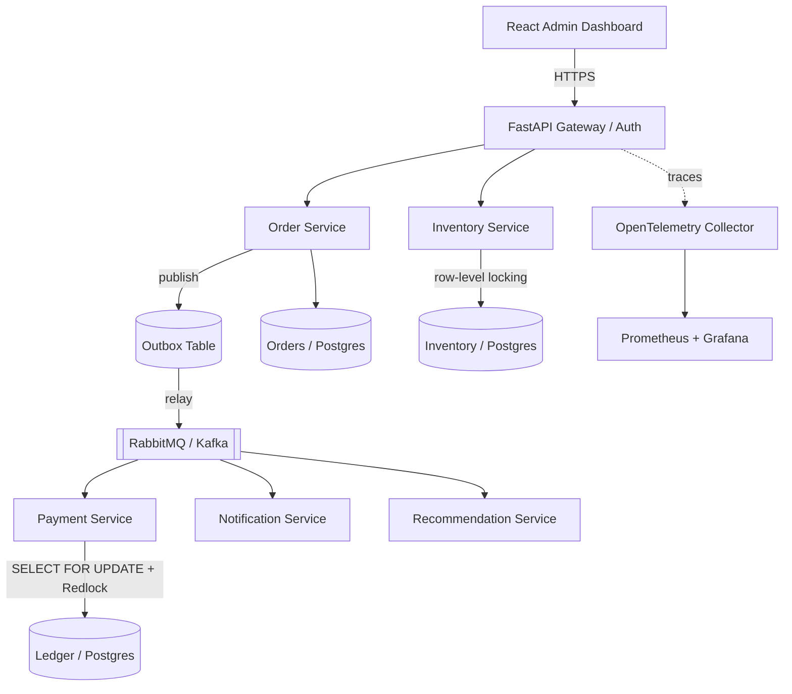

# Distributed Commerce & Payments Engine

> Not another Amazon clone — the backend architecture that would actually run one.

## 1. What this is and why it exists

A pure backend, event-driven microservices platform that simulates the core of a real e-commerce + payments system: order lifecycle management, inventory reservation under concurrency, idempotent payment processing, async notifications, and a lightweight recommendation service — all wired together with the reliability patterns (outbox, idempotency keys, distributed locks, rate limiting, distributed tracing) that separate a "CRUD demo" from a system that could survive production traffic.

This project exists to prove one thing under adversarial interview questioning: **I can design and operate a coherent distributed system, not just five apps that happen to share a database.** Every service reuses the same auth, observability, CI/CD, and testing conventions on purpose — the goal is architectural depth, not surface area.

**Status:** 🚧 In progress — Week 1 of build (Phase 1, Weeks 1–8).

## 2. Architecture



_Diagram will be refined as services are actually built — placeholder until Week 5–6 (event stream + dashboard)._

## 3. Key engineering decisions & trade-offs

_This section is the living log of "why," not just "what." Updated as each decision is made — not written retroactively at the end._

| Decision | Why | Trade-off accepted |
|---|---|---|
| _(TBD)_ Outbox pattern over direct dual-write | Reliable event publishing without 2PC | Slight latency from relay polling/CDC |
| _(TBD)_ `SELECT FOR UPDATE` + Redis Redlock for payment idempotency | Prevent double-spend under concurrent requests | Added write contention under high load |
| _(TBD)_ Token Bucket in Redis for rate limiting | Simple, well-understood, fast | Not as fair as sliding-window under bursty traffic |

## 4. Services

- **Order Service** — order lifecycle, saga orchestration across services
- **Inventory Service** — stock reservation with row-level locking to prevent overselling
- **Payment Service** (mocked gateway) — idempotent payment processing, double-spend prevention, ledger-style transaction log
- **Notification Service** — async email/notification dispatch via queue consumers
- **Recommendation Service** — lightweight collaborative-filtering / rules-based recommender
- **Admin Dashboard** (React) — order monitoring, inventory management, live metrics

## 5. Cross-cutting engineering

- Outbox pattern (Postgres → RabbitMQ/Kafka)
- Idempotency keys on all mutating endpoints
- Token Bucket rate limiting in Redis
- OpenTelemetry trace correlation (HTTP → workers → SQL)
- Prometheus + Grafana dashboards
- Full test suite (unit + integration + testcontainers), CI-gated merges
- Docker Compose for local dev; deployed to Render/Railway + Vercel

## 6. Tech stack

Python, FastAPI, PostgreSQL, Redis, RabbitMQ/Kafka, React + TypeScript, Docker, GitHub Actions, OpenTelemetry, Prometheus/Grafana.

## 7. Getting started

```bash
# Placeholder — filled in once the Docker Compose scaffold exists
docker-compose up --build
```

## 8. Test coverage / CI

[]()
[]()

## 9. Demo

_Screenshots / demo GIF / walkthrough video will be added once the system is live._
