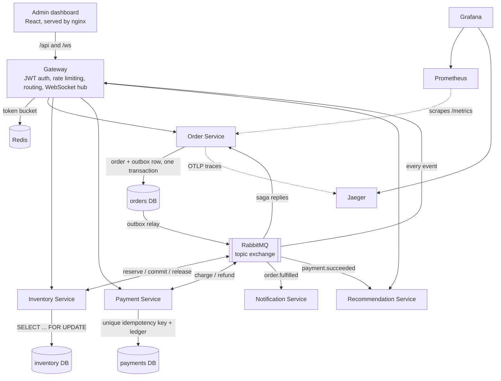

# Distributed Commerce & Payments Engine

> Not another Amazon clone — the backend architecture that would actually run one.

[](https://github.com/koushikrams29/distributed-commerce-payments-engine/actions/workflows/ci.yml)

📄 **[Product Requirements (PRD)](./docs/PRD.md)** — what the system does, end-to-end user and failure flows, functional requirements.
🏗️ **[Architecture & Technical Design](./docs/ARCHITECTURE.md)** — services, data model, API and event contracts, operations, and the full decisions log.
🚀 **[Deployment guide](./docs/DEPLOYMENT.md)** — from a new Oracle Cloud account to a live HTTPS demo.

## 1. What this is and why it exists

An event-driven microservices backend that simulates the core of an e-commerce and payments system: order lifecycle, inventory reservation under concurrency, idempotent payments with a ledger, notifications, and co-purchase recommendations — plus an operations console that shows each saga as it happens and lets an operator act on failures. The services are wired together with the reliability patterns that separate a CRUD demo from a system that could survive production traffic: a transactional outbox, idempotency keys backed by unique constraints, row-level locking, bounded retries with dead-letter queues, rate limiting, and distributed tracing.

This project exists to prove one thing under adversarial interview questioning: **I can design and operate a coherent distributed system, not just six apps that happen to share a database.** Every service follows the same auth, observability, testing and deployment conventions on purpose — the goal is architectural depth, not surface area.

**Status:** Phase 1 feature-complete — six services, the full saga with compensations, observability, container images, and a CI pipeline that ends with an end-to-end test of the running stack.

## 2. Architecture


```mermaid
graph TD
    Browser[Admin dashboard<br/>React, served by nginx] -->|/api and /ws| Gateway[Gateway<br/>JWT auth, rate limiting, routing, WebSocket hub]
    Gateway -->|token bucket| Redis[(Redis)]
    Gateway --> OrderSvc[Order Service]
    Gateway --> InventorySvc[Inventory Service]
    Gateway --> PaymentSvc[Payment Service]
    Gateway --> RecoSvc[Recommendation Service]
    OrderSvc -->|order + outbox row, one transaction| OrderDB[(orders DB)]
    OrderDB -->|outbox relay| MQ[[RabbitMQ<br/>topic exchange]]
    MQ <-->|reserve / commit / release| InventorySvc
    MQ <-->|charge / refund| PaymentSvc
    MQ -->|saga replies| OrderSvc
    MQ -->|order.fulfilled| NotificationSvc[Notification Service]
    MQ -->|payment.succeeded| RecoSvc
    MQ -->|every event| Gateway
    InventorySvc -->|SELECT ... FOR UPDATE| InvDB[(inventory DB)]
    PaymentSvc -->|unique idempotency key + ledger| PayDB[(payments DB)]
    OrderSvc -. OTLP traces .-> Jaeger[Jaeger]
    Prometheus[Prometheus] -. scrapes /metrics .-> OrderSvc
    Grafana[Grafana] --> Prometheus
    Grafana --> Jaeger
```

Each service owns its own Postgres database (one Postgres server locally), so no service can join or foreign-key into another's tables — cross-service consistency comes from the saga, not from shared transactions. Every service exports traces and metrics; the diagram shows one of each to stay readable.

## 3. How an order flows

1. The shopper posts an order with an idempotency key. Order Service stores it as `pending` and writes `order.created` to its outbox **in the same transaction**, then answers immediately.
2. The outbox relay publishes the event. Inventory locks the product rows, reserves stock and replies `inventory.reserved` (or `inventory.failed`, which cancels the order).
3. Order Service asks Payment to charge. Payment charges at most once per order — the guarantee is a unique constraint, not a lookup — and replies `payment.succeeded` or `payment.failed`.
4. On success the order becomes `paid`, Inventory commits the reservation, and the order becomes `fulfilled`; Notification records a confirmation and Recommendation updates its co-purchase counts.
5. On failure the order is cancelled and the reservation released. If a charge lands *after* an order was cancelled, the money is refunded rather than the order resurrected.

A reconciler moves orders stuck in any step toward a terminal state, and every handler is idempotent, so redelivered or out-of-order events are harmless. The admin dashboard receives every event over a WebSocket and shows each order's progress live.

## 4. Key engineering decisions & trade-offs

_Summarised here; the full log with reasoning (60+ entries) is in [`docs/ARCHITECTURE.md`](./docs/ARCHITECTURE.md#13-key-decisions-log)._

| Decision | Why | Trade-off accepted |
|---|---|---|
| RabbitMQ over Kafka | Lower operational complexity for a first distributed system; still demonstrates outbox, retries and dead letters fully | No partitioned replay; documented as a possible v2 migration |
| Saga via orchestration, not choreography | One service owns the order's state machine, so the flow is readable and debuggable in one place | Order Service is a central coordinator |
| Transactional outbox, not "write then publish" | An event is published if and only if the write committed — no ghost orders, no lost events | Events are delayed by the relay's polling interval |
| Idempotency enforced by unique constraints | A check-then-insert races; only the database constraint is a real guarantee under concurrent retries | Callers must send a key; replays need an extra lookup |
| No distributed lock (Redlock) around charges | The unique key already serialises concurrent charges inside the payment transaction; a Redis lock would add a dependency to the money path without strengthening that | None in practice — this is simpler and stronger |
| Bounded retries (2 s / 10 s / 30 s) then a dead-letter queue | A poison message can never block a queue; transient failures still recover on their own | Dead letters need an operator, with a replay tool provided |
| Token bucket rate limiting as a Redis Lua script, failing open | Atomic and fast; a Redis outage briefly loses throttling instead of taking checkout offline | Throttling is best-effort during a Redis outage |
| Traces straight to Jaeger over OTLP, no collector | One fewer container; adding a collector later is one environment variable | No tail sampling for now |

## 5. Services

- **Gateway** — login with rotating refresh tokens, JWT verification at the edge, per-user and per-IP rate limits, routing to the services, and the WebSocket hub that streams every event to the dashboard.
- **Order Service** — the order state machine and saga orchestrator, with the outbox relay and the stuck-order reconciler.
- **Inventory Service** — stock reservation with row-level locks so concurrent orders cannot oversell; commit and release are idempotent.
- **Payment Service** (mocked gateway) — at most one charge per order, refunds, and an append-only debit/credit ledger.
- **Notification Service** — consumes `order.fulfilled` and records a (fake) confirmation email, once per order.
- **Recommendation Service** — counts how often products are bought together from paid orders and serves "frequently bought with" lists.
- **Operations console** (React + TypeScript, no UI framework) — answers "is the system healthy right now?" from service health, queue depths, outbox lag and overdue orders; searchable orders with a per-order saga view and a timeline merged from every service's records; a filterable live event console; the payment ledger; stock flow from available to reserved to committed; and dead-letter inspection with confirmed replay. Every trace ID links to Jaeger.

## 6. Reliability and operations

- **Tracing:** one trace follows an order from the HTTP request through the outbox, RabbitMQ and every consumer down to the SQL statements; log lines carry the trace ID.
- **Metrics:** Prometheus scrapes every service; the provisioned Grafana dashboard covers HTTP latency and errors, order transitions, payment success rate, stock reservations, message outcomes, dead letters, outbox lag and rate-limit decisions.
- **Failure handling:** delayed retries, dead-letter queues that can be inspected and replayed from the console (or a CLI), a reconciler for stuck orders, and refunds for late charges.
- **Security:** bcrypt passwords, short-lived access tokens, hashed rotating refresh tokens, and every service verifying the JWT itself (defense in depth); only the dashboard's nginx is exposed.

## 7. Tech stack

Python 3.11, FastAPI, SQLAlchemy 2, Alembic, PostgreSQL 16, RabbitMQ, Redis, React + TypeScript (Vite), nginx, OpenTelemetry, Jaeger, Prometheus, Grafana, Docker Compose, GitHub Actions, pytest + testcontainers, uv-compiled dependency locks.

## 8. Getting started

Needs Docker. From the repository root:

```bash
cp infra/.env.example infra/.env
cd infra
docker compose -f docker-compose.yml -f docker-compose.app.yml up --build
```

Open http://localhost:8080 and sign in as `admin@example.com` / `admin-pass-123`. Traces are at http://localhost:16686 (Jaeger) and metrics at http://localhost:3000 (Grafana). Running services on the host for development is described in [ARCHITECTURE §8](./docs/ARCHITECTURE.md#8-local-dev-environment).

To put it on the internet over HTTPS on a free Oracle Cloud server, follow [`docs/DEPLOYMENT.md`](./docs/DEPLOYMENT.md): three scripts take a fresh Ubuntu machine to a running deployment.

## 9. Testing and CI

Every pull request runs, in GitHub Actions:

- **Unit and integration tests** for each service and the shared library. Integration tests start throwaway Postgres, Redis and RabbitMQ containers and apply the real migrations, so they prove the requirements against real infrastructure — for example, that concurrent reservations never oversell and that a redelivered charge never charges twice.
- **A branch-coverage gate** of 85% per project; each run's coverage tables appear on its summary page. Every project is currently between 91% and 96%.
- **A dependency-lock check**, so the images, CI and laptops always install identical versions.
- **An end-to-end test** that builds every image, starts the whole stack and places an order through the dashboard's proxy while watching the live event stream.
- **The console's tests and type-checked build**, including unit tests for how it derives saga state, system health and order timelines.

The testing strategy and its rules are described in [ARCHITECTURE §11](./docs/ARCHITECTURE.md#11-testing-strategy).
