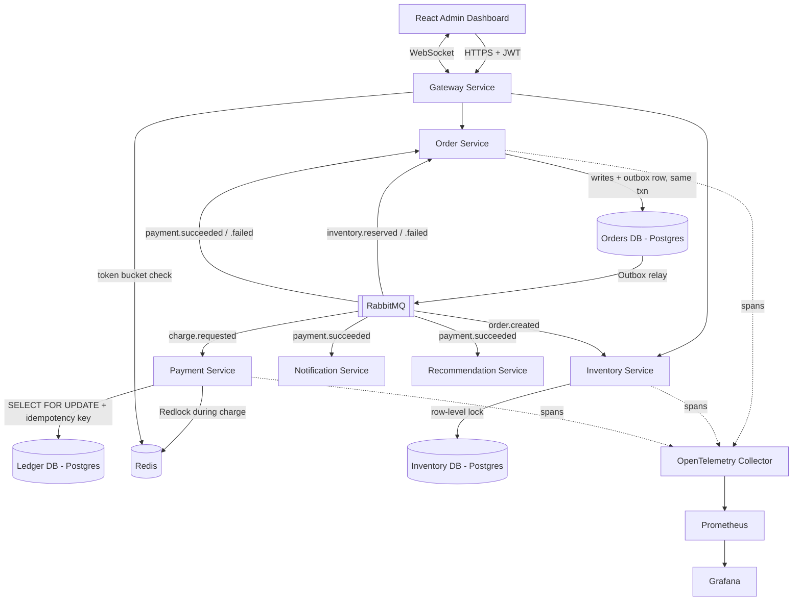

# Architecture & Technical Design — Distributed Commerce & Payments Engine

Companion to [`PRD.md`](./PRD.md). That doc says *what* the system does and *why* it exists; this doc says *how* it's built — services, data model, API contracts, event contracts, security, deployment, and the exact repo scaffold.

Every major pattern has a **📘 Concept** callout explaining what it is and why it exists, written for someone implementing it for the first time. Read the callout before writing the corresponding code.

---

## 1. Service architecture



### 📘 Concept — Why split into microservices instead of one FastAPI app?

Order, Inventory, and Payment have genuinely different consistency requirements: Inventory needs strict row-level locking under contention, Payment needs idempotency + a ledger, Notification can fail and silently retry without anyone caring. Splitting them forces you to solve *inter-service* consistency deliberately (the actual interview-relevant problem) instead of hiding everything behind one shared DB transaction. Each service below is an **independently deployable FastAPI app**, not a module — that distinction matters for how the scaffold (§7) and deployment (§9) are organized.

## 2. Services and ownership

| Service | Responsibility | Owns data | Public API? |
|---|---|---|---|
| Gateway | AuthN/AuthZ (JWT+OAuth2), rate limiting, request routing, WebSocket hub for the dashboard | — (stateless) | Yes — sole public entry point |
| Order Service | Order lifecycle state machine, saga orchestration | `orders`, `order_items`, `outbox` | Via Gateway only |
| Inventory Service | Stock levels, reservation, release-on-failure | `products`, `stock_reservations` | Via Gateway only |
| Payment Service | Idempotent mocked charge processing, ledger | `payments`, `ledger_entries`, `idempotency_keys` | Via Gateway only |
| Notification Service | Consumes events, logs (fake) email/SMS | `notifications` | No (consumer-only) |
| Recommendation Service | Rules-based co-purchase tracking off completed orders | `co_purchase_counts` | Via Gateway only (read endpoint) |

## 3. Data model

Types shown as Postgres types; every table has `id UUID PK` unless noted.

```
orders
  id              UUID PK
  user_id         UUID
  idempotency_key VARCHAR(255) NOT NULL
  status          VARCHAR(20)   -- pending | reserved | paid | fulfilled | cancelled
  total_amount    NUMERIC(12,2)
  created_at      TIMESTAMPTZ
  updated_at      TIMESTAMPTZ
  -- index: (status) for dashboard filtering
  -- unique constraint: (idempotency_key) — enforces FR-10 / PRD §7.2 at the DB
  --   level. A retried submission collides here and returns the original order
  --   instead of creating a second one.

order_items
  id              UUID PK
  order_id        UUID FK -> orders.id      -- real FK: same database
  product_id      UUID                      -- NO FK: products is owned by Inventory Service
  qty             INTEGER
  unit_price      NUMERIC(12,2)

outbox
  id              UUID PK
  aggregate_id    UUID
  event_type      VARCHAR
  payload_json    JSONB
  published_at    TIMESTAMPTZ NULL   -- NULL = not yet relayed

products
  id              UUID PK
  name            VARCHAR
  price           NUMERIC(12,2)
  stock_qty       INTEGER

stock_reservations
  id              UUID PK
  order_id        UUID                      -- NO FK: orders is owned by Order Service
  product_id      UUID FK -> products.id    -- real FK: same database
  qty             INTEGER
  status          VARCHAR(20)               -- held | released | committed
  expires_at      TIMESTAMPTZ

payments
  id                UUID PK
  order_id          UUID                    -- NO FK: orders is owned by Order Service
  idempotency_key   VARCHAR
  status            VARCHAR(20)             -- pending | succeeded | failed
  amount            NUMERIC(12,2)
  created_at        TIMESTAMPTZ
  -- unique index: (idempotency_key) — enforces FR-3 at the DB level, not just app logic

ledger_entries
  id              UUID PK
  payment_id      UUID FK -> payments.id    -- real FK: same database
  direction       VARCHAR(10)               -- debit | credit
  amount          NUMERIC(12,2)
  created_at      TIMESTAMPTZ

notifications
  id              UUID PK
  order_id        UUID                      -- NO FK: orders is owned by Order Service
  channel         VARCHAR(20)               -- email | sms
  status          VARCHAR(20)               -- sent | failed
  sent_at         TIMESTAMPTZ

co_purchase_counts
  id              UUID PK
  product_id_a    UUID                      -- NO FK: products is owned by Inventory Service
  product_id_b    UUID
  count           INTEGER
  -- unique index: (product_id_a, product_id_b)
```

### 📘 Concept — Why some references are foreign keys and others aren't

A foreign key can only be enforced against a table in the **same database**. Since each service owns its own database (§9), any reference that crosses a service boundary is stored as a plain UUID with no FK constraint — the database cannot check it.

That's not a shortcut, it's the defining constraint of this architecture: giving up database-enforced integrity across services is exactly *why* we need the saga pattern, compensating actions, and the outbox. If one database with foreign keys could keep everything consistent, none of those patterns would be necessary.

Status columns are stored as `VARCHAR` with the allowed values enforced in application code, rather than as native Postgres `ENUM` types. Native enums require an `ALTER TYPE` migration to add a single new value, which is needlessly painful; `VARCHAR` + an application-level enum keeps schema changes cheap while still giving one authoritative list of valid values in the code.

## 4. API contracts

All routes below are served through the Gateway (`/api/v1/...`), which proxies to the owning service after auth + rate-limit checks. Exact request/response field names may be refined once implemented — this is the contract we build against, not a guarantee it never changes.

### Auth (Gateway)

| Method | Path | Auth | Request | Response |
|---|---|---|---|---|
| POST | `/auth/login` | none | `{email, password}` | `{access_token, refresh_token}` |
| POST | `/auth/refresh` | refresh token | `{refresh_token}` | `{access_token}` |
| WS | `/ws/dashboard` | admin JWT | — | stream of order/inventory/payment events |

### Orders (Order Service)

| Method | Path | Auth | Request | Response |
|---|---|---|---|---|
| POST | `/orders` | shopper | `{items: [{product_id, qty}], idempotency_key}` | `201` with the created order; `200` with the existing order when the `idempotency_key` was already used |
| GET | `/orders/{id}` | shopper (own) / admin (any) | — | `{order_id, status, items, total_amount, timestamps}` |
| GET | `/orders` | admin | query: `status`, `cursor` | cursor-paginated list of orders |

`user_id` is currently accepted in the `POST /orders` request body as a temporary measure; it moves to the verified JWT subject once authentication lands (§6), at which point a client can no longer create orders on another user's behalf.

### Inventory (Inventory Service)

| Method | Path | Auth | Request | Response |
|---|---|---|---|---|
| GET | `/products` | admin | query: `cursor` | cursor-paginated list of `{id, name, price, stock_qty}` |
| GET | `/products/{id}` | admin | — | product detail + active reservations |

### Payments (Payment Service)

| Method | Path | Auth | Request | Response |
|---|---|---|---|---|
| GET | `/payments/{order_id}` | admin | — | `{payment_id, status, amount, ledger_entries[]}` |

### Recommendations (Recommendation Service)

| Method | Path | Auth | Request | Response |
|---|---|---|---|---|
| GET | `/recommendations/{product_id}` | admin | — | top co-purchased products |

### Health (every service)

| Method | Path | Auth | Response |
|---|---|---|---|
| GET | `/health` | none | `{status: "ok"}` — used by Docker Compose health checks and hosting-platform uptime checks |

## 5. Event contracts

| Event | Producer | Consumers | Key payload |
|---|---|---|---|
| `order.created` | Order Service | Inventory Service | `order_id, items[]` |
| `inventory.reserved` / `inventory.failed` | Inventory Service | Order Service | `order_id, reservation_id` |
| `charge.requested` | Order Service | Payment Service | `order_id, amount, idempotency_key` |
| `payment.succeeded` / `payment.failed` | Payment Service | Order, Notification, Recommendation | `order_id, payment_id, amount` |
| `order.cancelled` | Order Service | Inventory Service | `order_id` (triggers release) |

### 📘 Concept — Saga orchestration

No shared transaction spans all 5 services, so a multi-step operation needs an explicit way to undo earlier steps when a later one fails — that's a **saga**. We use **orchestration** (Order Service explicitly drives the sequence and reacts to each event) rather than **choreography** (services independently reacting with no central coordinator), because orchestration is far easier to reason about and debug the first time you build one.

### 📘 Concept — The Outbox pattern

If Order Service writes to Postgres and separately calls RabbitMQ, a crash between the two calls creates a "ghost" order with no event ever published. The **outbox pattern** writes the event into an `outbox` table in the *same transaction* as the business write, and a separate relay process publishes unpublished rows to RabbitMQ, retrying until success — guaranteeing "event published if and only if the write committed," without a distributed transaction.

### 📘 Concept — Idempotency keys

A retried "charge $50" request must not charge twice. The server stores "I've already handled key X, here's the result," and returns that cached result on retry instead of re-executing the charge.

### 📘 Concept — Row-level locking (`SELECT ... FOR UPDATE`)

Two concurrent requests both reading `stock_qty = 1` before either writes is a classic race → overselling. `SELECT ... FOR UPDATE` locks the row for the transaction's duration, turning the race into a queue of one.

### 📘 Concept — Redis Redlock

Row-level locking works within one Postgres instance; a lock that needs to span processes/services needs a **distributed lock**. Redlock acquires a mutually-exclusive lock across Redis with a TTL, so a crashed lock-holder self-expires instead of deadlocking everyone else.

### 📘 Concept — Token Bucket rate limiting

Each client has a bucket of N tokens refilling at a fixed rate; each request costs one token. Cheap (one Redis key per client), allows short bursts, enforces a long-run average — the standard real-world rate limiter.

### 📘 Concept — OpenTelemetry distributed tracing

A trace ID generated at the Gateway propagates through every HTTP call, queue message, and DB query, so "everything that happened for order #123" becomes one connected timeline across all 5 services — instead of grepping five log files and guessing at timestamps.

## 6. Security design

- **AuthN:** JWT access + refresh tokens issued by the Gateway via an OAuth2-compatible password flow (`OAuth2PasswordBearer`). Access tokens short-lived; refresh tokens longer-lived and rotated on use.
- **AuthZ:** Two roles, `shopper` and `admin`, carried as a claim in the JWT. Admin-only endpoints (dashboard reads, full order/payment lists) are enforced by a FastAPI dependency that checks the role claim — not by trusting the frontend to hide buttons.
- **Defense in depth:** downstream services (Order, Inventory, Payment, Recommendation) verify the JWT themselves via a shared `libs/common/auth` helper, rather than blindly trusting requests forwarded by the Gateway. A service is never exploitable by being called directly, bypassing the Gateway.
- **Secrets management:** local dev via a git-ignored `.env` file (see `.env.example` for required keys); production secrets live in the hosting platform's env var store — never committed.
- **Rate limiting as a security control:** the token bucket limiter on `/auth/login` doubles as brute-force/credential-stuffing protection, not just general abuse prevention.
- **Relevant OWASP Top 10 coverage:** injection (parameterized queries via SQLAlchemy, never string-built SQL), broken authentication (short-lived access tokens + refresh rotation), security misconfiguration (no default credentials, secrets never in source control).

## 7. Repo scaffold

This is a **monorepo containing multiple independently-deployable services** — one git repo (per the "two repos, one per flagship project" rule), but internally structured so each service has its own Dockerfile, dependencies, and can be deployed/scaled independently. This is the standard real-world pattern for a microservices demo project — not a single `main.py` with everything crammed in, and not five separate repos either.

```
distributed-commerce-payments-engine/
├── docs/
│   ├── PRD.md
│   └── ARCHITECTURE.md
├── services/
│   ├── gateway/
│   │   ├── app/
│   │   │   ├── main.py                 # FastAPI app instance, middleware, startup/shutdown
│   │   │   ├── api/
│   │   │   │   └── routers/
│   │   │   │       ├── auth.py         # /auth/login, /auth/refresh
│   │   │   │       └── ws.py           # WebSocket hub for dashboard
│   │   │   ├── core/
│   │   │   │   ├── config.py           # env-based settings (pydantic-settings)
│   │   │   │   ├── security.py         # JWT issue/verify, RBAC dependency
│   │   │   │   └── rate_limit.py       # token bucket dependency
│   │   │   └── proxy/                  # forwards requests to downstream services
│   │   ├── tests/
│   │   ├── Dockerfile
│   │   └── requirements.txt
│   │
│   ├── order-service/
│   │   ├── app/
│   │   │   ├── main.py
│   │   │   ├── api/
│   │   │   │   └── routers/
│   │   │   │       └── orders.py       # POST /orders, GET /orders/{id}, GET /orders
│   │   │   ├── core/                   # config, db session, tracing setup
│   │   │   ├── models/                 # SQLAlchemy ORM models
│   │   │   ├── schemas/                # Pydantic request/response DTOs
│   │   │   ├── services/               # business logic: order_service.py, saga.py
│   │   │   ├── repositories/           # DB access layer (order_repo.py)
│   │   │   └── events/                 # outbox publisher, event consumers, event schemas
│   │   ├── alembic/                    # DB migrations
│   │   ├── tests/
│   │   │   ├── unit/
│   │   │   └── integration/            # testcontainers-based
│   │   ├── Dockerfile
│   │   └── requirements.txt
│   │
│   ├── inventory-service/              # same internal layout as order-service
│   ├── payment-service/                # same internal layout as order-service
│   ├── notification-service/           # same layout, simpler (consumer only, no public router)
│   └── recommendation-service/         # same layout, simplest (consumer + one read endpoint)
│
├── libs/
│   └── common/                         # shared code installed as local editable package
│       ├── events/                     # shared event schema definitions (Pydantic)
│       ├── tracing/                    # shared OpenTelemetry setup helper
│       └── auth/                       # shared JWT verification helper (for services behind Gateway)
│
├── frontend/
│   ├── src/
│   │   ├── pages/                      # Dashboard, Orders, Inventory, Metrics
│   │   ├── components/                 # shared UI pieces (OrderRow, StatusBadge, etc.)
│   │   ├── api/                        # typed API client per backend domain
│   │   ├── hooks/                      # useOrders(), useLiveUpdates(), etc.
│   │   ├── store/                      # Zustand store
│   │   └── App.tsx
│   ├── package.json
│   └── vite.config.ts
│
├── infra/
│   ├── docker-compose.yml              # postgres, redis, rabbitmq, otel-collector, prometheus, grafana + all services
│   ├── otel-collector-config.yaml
│   ├── prometheus.yml
│   └── grafana/
│       └── dashboards/
│
├── .github/
│   └── workflows/
│       └── ci.yml                      # lint + test + build, gates merges
│
├── .env.example
├── .gitignore
└── README.md
```

### 📘 Concept — Routers organized by domain, not by UI page

**Routers are grouped by backend resource/domain (a "bounded context"), never by frontend page.** `order-service/app/api/routers/orders.py` exposes `POST /orders`, `GET /orders/{id}`, etc. — that's the entire feature surface for the Order domain, and it exists independently of how any UI happens to display orders.

The frontend's page structure (`frontend/src/pages/Dashboard.tsx`, `Orders.tsx`, `Inventory.tsx`) is a **completely separate organizing axis** — a single page like `Dashboard.tsx` can call multiple backend routers across multiple services (orders + inventory + metrics) to assemble one screen. Backend structure = resource-oriented (REST). Frontend structure = user-journey-oriented (pages/screens). They're never forced to mirror each other — trying to make them mirror each other is a common beginner mistake, and a sign of a codebase that resembles its UI mockups more than its actual domain model.

Within a single service, if it owns more than one resource type, you'd add more router files (e.g., Inventory Service could eventually split into `routers/products.py` and `routers/reservations.py`) — the split is always "what resource does this represent," never "what screen shows this."

### 📘 Concept — The layered structure inside each service (`routers → services → repositories → models`)

This is what separates a "mature" codebase from a fresher one: **routers never contain business logic.** A router function does exactly three things — validate the request (via a Pydantic schema), call a service-layer function, and return the response. All the actual logic (state transitions, locking, calling the outbox) lives in `services/`. All raw DB queries live in `repositories/`. This means:

- You can unit-test `services/order_service.py` without spinning up FastAPI or HTTP at all.
- You can swap how data is stored (`repositories/`) without touching business logic.
- Nobody has to read a 300-line router function to understand what "placing an order" actually does.

## 8. Local dev environment

`infra/docker-compose.yml` brings up: `postgres`, `redis`, `rabbitmq`, `otel-collector`, `prometheus`, `grafana`, plus one container per service in `services/`, plus the `frontend`. Single command: `docker-compose up --build` from `infra/`. Exact service names/ports get filled in here once the compose file exists.

## 9. Deployment architecture

- Each service is its own Docker image, deployed as an independent Render/Railway service. Notification and Recommendation are consumer-only (no public traffic needed beyond a `/health` check).
- Inter-service URLs are **environment-variable-driven** (e.g., `ORDER_SERVICE_URL`), never hardcoded — this is what lets the exact same code run against Docker Compose service names locally and against real public/internal URLs in production.
- Postgres/Redis/RabbitMQ: containers locally (via Compose), managed free-tier instances in production (Neon for Postgres, Upstash for Redis, CloudAMQP for RabbitMQ) — same connection string interface either way, swapped via env vars.
- Frontend deployed to Vercel, pointed at the Gateway's public URL.
- Every service exposes `/health`, used by both Docker Compose (`depends_on: condition: service_healthy`) and the hosting platform's uptime checks.
- **Known risk:** free-tier hosts may cold-start/sleep after inactivity. Mitigation: the `docker-compose up` local path always works as a live-demo fallback, independent of hosting uptime.

## 10. Observability

- **Metrics (Prometheus):** `http_requests_total`, `http_request_duration_seconds`, `order_status_transitions_total{status}`, `inventory_reservation_conflicts_total`, `payment_attempts_total{result}`, `outbox_publish_lag_seconds`.
- **Traces (OpenTelemetry):** one trace per inbound request; a span per service hop, per DB query, and per MQ publish/consume — so a single order's full path is one connected timeline.
- **Dashboards (Grafana):** "Order Pipeline Health" (throughput/failure rate by stage), "Payment Correctness" (idempotency hit rate, ledger balance sanity), "System Latency" (p50/p95/p99 per service).
- **Logs:** structured JSON, correlated with trace ID, so a log line can always be tied back to the trace that produced it.

## 11. Testing strategy

- **Unit tests** (`services/*/tests/unit/`) — business logic and schema validation in isolation (order totals, state transitions, rate limiter math), no DB or broker. Must stay fast enough to run on every save; the Order Service suite runs in ~0.1s.
- **Integration tests** (`services/*/tests/integration/`) — a throwaway Postgres/Redis/RabbitMQ per session via `testcontainers`, proving the FRs in the PRD (e.g., fire concurrent requests, assert exactly one succeeds). Marked `integration` so the fast loop can be run with `pytest -m "not integration"`.
- **CI** (`.github/workflows/ci.yml`) — runs the full suite on every push to `main` and every PR; merges blocked on failure. Services are a build matrix, so adding a service is a one-line change.

Three rules the Order Service suite establishes for every service that follows:

1. **Integration tests run the real Alembic migrations against the throwaway database**, on the same Postgres image as `infra/docker-compose.yml`. The schema under test is therefore the schema that migrations actually produce, and a broken migration fails the test suite rather than a deployment.
2. **Migration drift is a test, not a separate CI step** (`tests/integration/test_migrations.py`). It compares the migrated database against the ORM metadata — the same comparison `alembic check` performs — but reuses the container the suite already started, so it also runs locally and needs no extra CI infrastructure. A model edited without `alembic revision --autogenerate` fails the build.
3. **Idempotency keys are generated per test run, never hardcoded.** A key is single-use for life, so a fixed key makes a test pass once and fail on every subsequent run.

Tests are written alongside each feature as it's built, not deferred to a dedicated "testing phase" — the engineering schedule that enforces this is tracked separately outside this repository.

## 12. Scalability & future considerations

Out of scope for v1 (see PRD non-goals), but documented because this is exactly what gets asked about in interviews:

- **Inventory contention:** move from single-row locking to sharding stock by `product_id`/region if specific products become hot spots.
- **Ledger growth:** `ledger_entries` is append-only, so it partitions cleanly by time range for archival without touching live data.
- **RabbitMQ → Kafka:** documented as a possible v2 migration if consumer replay or partitioned ordering becomes necessary (see decision log below).
- **Read scaling:** Postgres read replicas to offload the Admin Dashboard's read-heavy queries from the write path.
- **Outbox relay at scale:** polling the outbox table works at this scale; at high write volume it would move to CDC (e.g., Debezium) instead.

## 13. Key decisions log

| Decision | Reasoning | Status |
|---|---|---|
| RabbitMQ over Kafka | Lower operational complexity for a first solo distributed system; still demonstrates outbox/retry/DLQ fully | ✅ Decided |
| Monorepo with per-service folders, not 5 separate repos | Keeps "one repo per flagship project" while still being independently deployable per service | ✅ Decided |
| Saga via orchestration, not choreography | Easier to reason about/debug when implementing the pattern for the first time | ✅ Decided |
| Layered structure (routers/services/repositories/models) in every service | Testability + separation of concerns; the actual difference between "mature" and "fresher" codebases | ✅ Decided |
| Services verify JWT independently, not just the Gateway | Defense in depth — no service is exploitable via direct access | ✅ Decided |
| Order status values: `pending`, `reserved`, `paid`, `fulfilled`, `cancelled` | Matches the saga's state transitions exactly; stored as `VARCHAR` + application-level enum so adding a status doesn't need an `ALTER TYPE` migration | ✅ Decided |
| No foreign keys across service boundaries | A FK can only be enforced within one database; cross-service references are plain UUIDs, with consistency maintained by events/sagas instead | ✅ Decided |
| One Postgres container locally, one database per service | Enforces the service data boundary (cross-service FKs become impossible by construction) without running six containers on a laptop | ✅ Decided |
| Money stored as `NUMERIC(12,2)`, never float | Floating point can't represent decimal fractions exactly — unacceptable for currency | ✅ Decided |
| Alembic for schema migrations, not `create_all()` | `create_all()` can only create missing tables, never evolve existing ones without data loss | ✅ Decided |
| Idempotency enforced by a unique DB constraint, not an application-level check | A check-then-insert has a race window: two concurrent requests with the same key can both pass the check. Only the constraint is a true guarantee; the app-level lookup is a fast path that avoids the exception in the common case | ✅ Decided |
| `idempotency_key` required, not optional | An optional key would let a caller silently opt out of the exactly-once guarantee the PRD promises; making it mandatory pushes retry-safety onto every client by construction | ✅ Decided |
| Replayed request returns `200`, not `201` | `201 Created` would assert that a resource was created, which is false on a replay; the caller still receives the order, correctly labelled as pre-existing | ✅ Decided |
| Integration tests use `testcontainers`, not a shared test database | A throwaway container per session means tests never depend on machine state or leftover rows, and CI needs no pre-provisioned database | ✅ Decided |
| Test dependencies split into `requirements-dev.txt` | Production images should not ship `pytest`, `httpx`, or the Docker client library used by `testcontainers` | ✅ Decided |
| `alembic.ini` ships with no `sqlalchemy.url` | The connection string is resolved in `env.py` from the environment, so no credentials are committed and tests can point migrations at a throwaway database | ✅ Decided |
| Mocked payment gateway interface shape | — | ⏳ Open — see PRD §12 |

## 14. Risks

- Free-tier hosting (Render/Railway) may cold-start/sleep for a live demo — mitigated by the `docker-compose up` local fallback (§9).
- Recommendation Service scope creep — keep it deliberately minimal, it's explicitly not the point of this project (see PRD non-goals).
