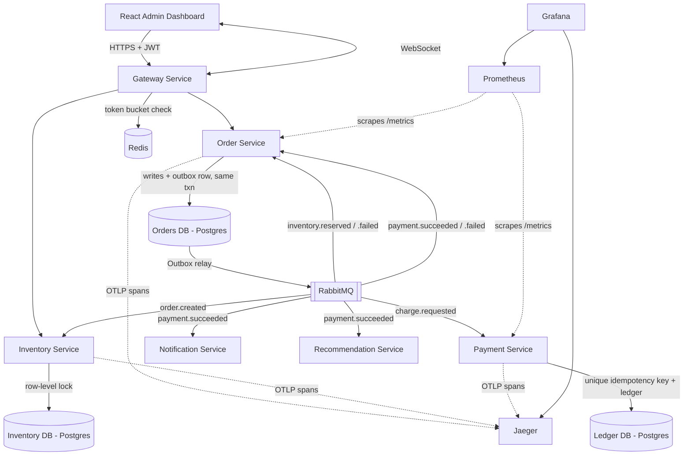
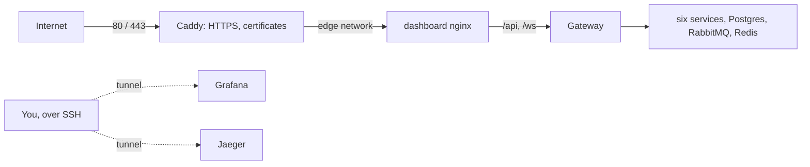

# Architecture & Technical Design — Distributed Commerce & Payments Engine

Companion to [`PRD.md`](./PRD.md). That doc says *what* the system does and *why* it exists; this doc says *how* it's built — services, data model, API contracts, event contracts, security, deployment, and the exact repo scaffold.

Every major pattern has a **📘 Concept** callout explaining what it is and why it exists, written for someone implementing it for the first time. Read the callout before writing the corresponding code.

---

## 1. Service architecture


```mermaid
graph TD
    Client[React Admin Dashboard] -->|HTTPS + JWT| Gateway[Gateway Service]
    Gateway --> OrderSvc[Order Service]
    Gateway --> InventorySvc[Inventory Service]
    OrderSvc -->|writes + outbox row, same txn| OrderDB[(Orders DB - Postgres)]
    OrderDB -->|Outbox relay| MQ[[RabbitMQ]]
    MQ -->|order.created| InventorySvc
    MQ -->|inventory.reserved / .failed| OrderSvc
    MQ -->|charge.requested| PaymentSvc[Payment Service]
    PaymentSvc -->|unique idempotency key + ledger| Ledger[(Ledger DB - Postgres)]
    MQ -->|payment.succeeded / .failed| OrderSvc
    MQ -->|payment.succeeded| NotificationSvc[Notification Service]
    MQ -->|payment.succeeded| RecoSvc[Recommendation Service]
    InventorySvc -->|row-level lock| InvDB[(Inventory DB - Postgres)]
    Gateway -->|token bucket check| Redis[(Redis)]
    OrderSvc -. OTLP spans .-> Jaeger[Jaeger]
    InventorySvc -. OTLP spans .-> Jaeger
    PaymentSvc -. OTLP spans .-> Jaeger
    Prom[Prometheus] -. scrapes /metrics .-> OrderSvc
    Prom -. scrapes /metrics .-> PaymentSvc
    Grafana[Grafana] --> Prom
    Grafana --> Jaeger
    Gateway <-->|WebSocket| Client
```

### 📘 Concept — Why split into microservices instead of one FastAPI app?

Order, Inventory, and Payment have genuinely different consistency requirements: Inventory needs strict row-level locking under contention, Payment needs idempotency + a ledger, Notification can fail and silently retry without anyone caring. Splitting them forces you to solve *inter-service* consistency deliberately (the actual interview-relevant problem) instead of hiding everything behind one shared DB transaction. Each service below is an **independently deployable FastAPI app**, not a module — that distinction matters for how the scaffold (§7) and deployment (§9) are organized.

## 2. Services and ownership

| Service | Responsibility | Owns data | Public API? |
|---|---|---|---|
| Gateway | AuthN/AuthZ (JWT+OAuth2), rate limiting, request routing, WebSocket hub for the dashboard | `users`, `refresh_tokens` | Yes — sole public entry point |
| Order Service | Order lifecycle state machine, saga orchestration | `orders`, `order_items`, `outbox` | Via Gateway only |
| Inventory Service | Stock levels, reservation, release-on-failure | `products`, `stock_reservations` | Via Gateway only |
| Payment Service | Idempotent mocked charge processing, ledger | `payments`, `ledger_entries` | Via Gateway only |
| Notification Service | Consumes events, logs (fake) email/SMS | `notifications` | No (consumer-only) |
| Recommendation Service | Rules-based co-purchase tracking off completed orders | `co_purchase_counts` | Via Gateway only (read endpoint) |

## 3. Data model

Types shown as Postgres types; every table has `id UUID PK` unless noted.

```
orders
  id              UUID PK
  user_id         UUID
  idempotency_key VARCHAR(255) NOT NULL
  status          VARCHAR(20)   -- pending | reserved | paid | fulfilled | cancelled
  total_amount    NUMERIC(12,2)
  created_at      TIMESTAMPTZ
  updated_at      TIMESTAMPTZ
  -- index: (status) for dashboard filtering
  -- unique constraint: (user_id, idempotency_key) — enforces FR-10 / PRD §7.2
  --   per shopper. A retried submission collides here and returns the original
  --   order. Keys are not globally unique so two shoppers may reuse the same
  --   client-generated string without leaking each other's orders.

order_items
  id              UUID PK
  order_id        UUID FK -> orders.id      -- real FK: same database
  product_id      UUID                      -- NO FK: products is owned by Inventory Service
  qty             INTEGER
  unit_price      NUMERIC(12,2)

outbox
  id              UUID PK
  aggregate_id    UUID
  event_type      VARCHAR
  payload_json    JSONB
  published_at    TIMESTAMPTZ NULL   -- NULL = not yet relayed

products
  id              UUID PK
  name            VARCHAR
  price           NUMERIC(12,2)
  stock_qty       INTEGER

stock_reservations
  id              UUID PK
  order_id        UUID                      -- NO FK: orders is owned by Order Service
  product_id      UUID FK -> products.id    -- real FK: same database
  qty             INTEGER
  status          VARCHAR(20)               -- held | released | committed
  expires_at      TIMESTAMPTZ

payments
  id                UUID PK
  order_id          UUID                    -- NO FK: orders is owned by Order Service
  idempotency_key   VARCHAR
  status            VARCHAR(20)             -- pending | succeeded | failed
  amount            NUMERIC(12,2)
  created_at        TIMESTAMPTZ
  -- unique index: (idempotency_key) — enforces FR-3 at the DB level, not just app logic

ledger_entries
  id              UUID PK
  payment_id      UUID FK -> payments.id    -- real FK: same database
  direction       VARCHAR(10)               -- debit | credit
  amount          NUMERIC(12,2)
  created_at      TIMESTAMPTZ

notifications
  id              UUID PK
  order_id        UUID                      -- NO FK: orders is owned by Order Service
  channel         VARCHAR(20)               -- email | sms
  status          VARCHAR(20)               -- sent | failed
  sent_at         TIMESTAMPTZ

co_purchase_counts
  id              UUID PK
  product_id_a    UUID                      -- NO FK: products is owned by Inventory Service
  product_id_b    UUID
  count           INTEGER
  -- unique index: (product_id_a, product_id_b)
```

### 📘 Concept — Why some references are foreign keys and others aren't

A foreign key can only be enforced against a table in the **same database**. Since each service owns its own database (§9), any reference that crosses a service boundary is stored as a plain UUID with no FK constraint — the database cannot check it.

That's not a shortcut, it's the defining constraint of this architecture: giving up database-enforced integrity across services is exactly *why* we need the saga pattern, compensating actions, and the outbox. If one database with foreign keys could keep everything consistent, none of those patterns would be necessary.

Status columns are stored as `VARCHAR` with the allowed values enforced in application code, rather than as native Postgres `ENUM` types. Native enums require an `ALTER TYPE` migration to add a single new value, which is needlessly painful; `VARCHAR` + an application-level enum keeps schema changes cheap while still giving one authoritative list of valid values in the code.

## 4. API contracts

All routes below are served through the Gateway (`/api/v1/...`), which proxies to the owning service after auth + rate-limit checks. Exact request/response field names may be refined once implemented — this is the contract we build against, not a guarantee it never changes.

The Gateway (port 8001) maps the first path segment to a service: `orders` → Order (8000); `products`, `reservations` → Inventory (8002); `charges`, `payments` → Payment (8003); `recommendations` → Recommendation (8005). For example, `GET /api/v1/orders/123` is forwarded as `GET /orders/123`. The Gateway rejects missing or invalid tokens with `401` before forwarding; role checks happen in the owning service. If the downstream service is unreachable the Gateway returns `502`, and `504` if it times out (`PROXY_TIMEOUT_SECONDS`).

**Rate limiting (FR-7).** Token buckets in Redis, checked after the token is validated and before anything is forwarded:

| Bucket | Keyed by | Default | Applies to |
|---|---|---|---|
| `api` | user ID (JWT `sub`) | burst 20, refill 5/s | every `/api/v1/...` proxied request |
| `auth` | client IP | burst 5, refill 1 per 12 s | `/auth/login`, `/auth/refresh` (both prefixes) |

Responses carry `X-RateLimit-Limit` and `X-RateLimit-Remaining`; a rejected request gets `429` with `Retry-After` (seconds) and never reaches the downstream service. The check-and-spend is one Lua script, so it is atomic across concurrent requests and multiple Gateway instances, and it uses the Redis server clock so instances agree on time. If Redis is unreachable the Gateway allows the request and logs a warning (fail open). Behind a load balancer, run uvicorn with `--proxy-headers` so the `auth` bucket sees the real client IP. Settings: `REDIS_URL`, `RATE_LIMIT_ENABLED`, `RATE_LIMIT_{API,AUTH}_{CAPACITY,REFILL_PER_SECOND}`.

### Auth (Gateway)

| Method | Path | Auth | Request | Response |
|---|---|---|---|---|
| POST | `/api/v1/auth/login` | none | `{email, password}` | `{access_token, refresh_token}` |
| POST | `/api/v1/auth/refresh` | refresh token | `{refresh_token}` | `{access_token}` |
| WS | `/ws/dashboard` | admin JWT (first frame) | see below | live stream of every bus event |

### Live dashboard (FR-6)

Each Gateway instance consumes every routing key (`#`) on its own private, auto-deleted RabbitMQ queue, so every instance sees every event and can serve any connected admin. An in-memory hub copies each event to every open socket on that instance.

| Step | Direction | Frame |
|---|---|---|
| 1 | client → server | `{"type": "auth", "token": "<access JWT>"}` — must arrive within `DASHBOARD_AUTH_TIMEOUT_SECONDS` (5) |
| 2 | server → client | `{"type": "ready"}` — client should now load its snapshot (`GET /api/v1/orders`, `/products`) |
| 3+ | server → client | `{"type": "<routing key>", "data": {...event payload}, "received_at": "<ISO time>", "trace_id": "<32 hex chars or null>"}` |

| Close code | Meaning | Client should |
|---|---|---|
| `4401` | missing/invalid/expired token, or no auth frame in time; also sent when the token expires mid-stream | refresh the token, reconnect |
| `4403` | valid token, not an admin | stop |
| `1013` | client fell more than 256 events behind and was dropped | reconnect and reload the snapshot |

The token is sent in the first frame rather than the URL so it never appears in proxy or access logs. Events are not replayed: the stream is a live view, and the client resynchronises from the REST snapshot after every (re)connect. The dashboard merges snapshot and live updates by lifecycle position (`pending` < `reserved` < `paid` < `fulfilled`/`cancelled`), which is correct regardless of arrival order because statuses only move forward. If RabbitMQ restarts, the consumer reconnects every 5 s. The React client lives in `frontend/` (see §8). Set `CORS_ALLOWED_ORIGINS` only when the dashboard is hosted on a different origin than the Gateway.

`trace_id` is the trace of the consumer span that received the event, which continues the publisher's trace through the message headers. The console links it to Jaeger, so any event in the feed opens the request that caused it.

### Operations (Gateway)

Served by the Gateway itself, not proxied: they combine every service's view, which no single service has. Admin only (`403` otherwise), rate-limited in the `api` bucket.

| Method | Path | Request | Response |
|---|---|---|---|
| GET | `/api/v1/ops/health` | — | `{components: [{name, kind, status: up\|degraded\|down, detail, latency_ms}], checked_at}` — the Gateway and its database, every service's `/health/db`, RabbitMQ (management API) and Redis, checked concurrently with a short timeout each |
| GET | `/api/v1/ops/queues` | — | `{queues: [{name, ready, unacknowledged, consumers, retrying, dead_lettered, publish_rate, deliver_rate}], checked_at}` — each work queue with the sum of its `.retry.*` queues and its `.dlq`; `503` if the management API is unreachable |
| GET | `/api/v1/ops/dead-letters/{queue}` | query: `limit` (1–100, default 20) | `{queue, total, messages: [{routing_key, payload, order_id, retry_count, last_error, dead_lettered_at, message_id}]}` — oldest first; reading leaves them on the queue; `404` for anything but a work queue |
| POST | `/api/v1/ops/dead-letters/{queue}/replay` | `{limit: int \| null}` (null replays all) | `{queue, replayed}` — the same operation as the replay CLI; the admin's user ID is logged |

Queue names are validated against a strict pattern and must have a `.dlq` sibling, so the endpoints cannot be pointed at arbitrary queues. Settings: `RABBITMQ_MANAGEMENT_URL` (credentials come from `RABBITMQ_URL`) and `NOTIFICATION_SERVICE_URL` for the health check.

### Orders (Order Service)

| Method | Path | Auth | Request | Response |
|---|---|---|---|---|
| POST | `/orders` | shopper (JWT) | `{items: [{product_id, qty}], idempotency_key}` | `201` with the created order; `200` with the existing order when the `(user, idempotency_key)` pair was already used |
| GET | `/orders/{id}` | shopper (own) / admin (any) | — | `{order_id, status, items, total_amount, timestamps}` |
| GET | `/orders` | admin | query: `status`, `created_from`, `created_to` (ISO instants with an offset), `cursor`, `limit` (1–100) | cursor-paginated list of orders, newest first |
| GET | `/orders/summary` | admin | — | `{counts: {status: n}, total, outbox: {unpublished, oldest_unpublished_at}, overdue: [{status, count, after_minutes}], reconciler_enabled, reconcile_interval_seconds, generated_at}` — "overdue" uses the reconciler's own timeouts and clocks |
| GET | `/orders/{id}/events` | admin | — | the outbox rows for one order, oldest first: `[{id, event_type, payload, created_at, published_at, trace_id}]`; `published_at` is null while the relay has not sent it |

`user_id` is taken from the verified JWT `sub` claim — it is not accepted in the request body. Shoppers receive `404` (not `403`) when reading another user's order so that order IDs are not confirmed to exist across accounts.

### Inventory (Inventory Service)

| Method | Path | Auth | Request | Response |
|---|---|---|---|---|
| GET | `/products` | admin | — | `{items: [{id, name, price, stock_qty, reserved_qty, committed_qty}]}` — `stock_qty` is what can still be reserved (held units are already deducted); `reserved_qty` is held, `committed_qty` sold |
| GET | `/reservations` | admin | query: `order_id`, `status` (`held`, `committed`, `released`), `limit` (1–200) | reservation rows with product names, newest first |
| GET | `/products/{id}` | authenticated | — | catalogue fields; `active_reservations` only included for admin |
| POST | `/reservations` | authenticated | `{order_id, items: [{product_id, qty}]}` | `201` with held reservations; `409` if stock insufficient |
| POST | `/reservations/{order_id}/release` | authenticated | — | restores held stock for that order; no-op once committed |
| POST | `/reservations/{order_id}/commit` | authenticated | — | marks held stock `committed` (paid for, never released); idempotent |

With `USE_EVENT_BUS=true`, reserve, commit and release run via RabbitMQ events; with `USE_EVENT_BUS=false` (CI), Order Service calls these HTTP endpoints directly. Reservation rows are locked during commit and release, so the two cannot both succeed for one order. A replayed reservation for an order that already has reservations — in any status — returns the existing rows instead of deducting stock again.

### Payments (Payment Service)

| Method | Path | Auth | Request | Response |
|---|---|---|---|---|
| POST | `/charges` | authenticated | `{order_id, amount, idempotency_key}` | `201` on first charge; `200` when the same charge is replayed; `409` when the key already belongs to a different order or amount |
| GET | `/payments` | admin | query: `status`, `cursor`, `limit` (1–100) | cursor-paginated charges with their ledger entries, newest first |
| GET | `/payments/summary` | admin | — | `{counts: {status: n}, total, captured_amount, refunded_amount, net_amount, generated_at}` — money totals come from the ledger, not the payment rows |
| GET | `/payments/{order_id}` | admin | — | `{payment_id, status, amount, ledger_entries[]}` |

With `USE_EVENT_BUS=true`, Order Service writes `order.created` and `charge.requested` to the outbox (same DB transaction), a relay publishes to RabbitMQ, and Inventory/Payment consumers handle reserve/charge. Set `USE_EVENT_BUS=false` to fall back to HTTP `BackgroundTasks` (used in CI).

After a successful charge the order becomes `paid` and emits `order.paid`; Inventory commits the reservation and replies `inventory.committed`; the order becomes `fulfilled` and emits `order.fulfilled`. Every status change locks the order row first (`SELECT ... FOR UPDATE`), so two events — or an event and the reconciler — never act on the same old status.

If `payment.succeeded` arrives for an order that is already `cancelled` (the reconciler gave up first and released the stock), Order Service emits `refund.requested`; Payment Service marks the payment `refunded`, writes a `credit` ledger entry and emits `payment.refunded`. Refunds lock the payment rows, so a redelivered request cannot credit twice.

A background **reconciler** (FR-5) moves every order toward a terminal status:

| Stuck in | After | Action |
|---|---|---|
| `pending` | `RECONCILE_PENDING_AFTER_MINUTES` (30) since creation | cancel + `order.cancelled` (release is a no-op if nothing was held) |
| `reserved` | `RECONCILE_RESERVED_AFTER_MINUTES` (30) since creation | cancel + `order.cancelled` |
| `paid` | `RECONCILE_PAID_AFTER_MINUTES` (10) since last update | never cancelled — money was taken; re-send `order.paid` and restart the timer |

The reconciler selects with `FOR UPDATE SKIP LOCKED`, skipping any order an event handler is changing at that moment.

### Notifications (Notification Service)

Consumer-only — no public write API. Listens for `order.fulfilled` on RabbitMQ and records a fake email confirmation in `notifications` (FR-8), idempotent per `(order_id, channel)`. Exposes `/health` only.

| Method | Path | Auth | Response |
|---|---|---|---|
| GET | `/health` | none | `{status: "ok"}` |

### Recommendations (Recommendation Service)

| Method | Path | Auth | Request | Response |
|---|---|---|---|---|
| GET | `/recommendations/{product_id}` | admin | query: `limit` | `{product_id, items: [{product_id, co_purchase_count}]}` |

Consumes `payment.succeeded` (with `items[]` in the payload) and increments pairwise co-purchase counts. Idempotent per `order_id`.

### Health (every service)

| Method | Path | Auth | Response |
|---|---|---|---|
| GET | `/health` | none | `{status: "ok"}` — used by Docker Compose health checks and hosting-platform uptime checks |

## 5. Event contracts

| Event | Producer | Consumers | Key payload |
|---|---|---|---|
| `order.created` | Order Service | Inventory Service | `order_id, items[]` |
| `inventory.reserved` / `inventory.failed` | Inventory Service | Order Service | `order_id, reservation_id` |
| `charge.requested` | Order Service | Payment Service | `order_id, amount, idempotency_key` (always `order-<order_id>`), `items[]` |
| `payment.succeeded` / `payment.failed` | Payment Service | Order, Recommendation | `order_id, payment_id, amount, items[]` (items on success only); a refused charge has `reason` and no `payment_id` |
| `order.cancelled` | Order Service | Inventory Service | `order_id` (triggers release) |
| `order.paid` | Order Service | Inventory Service | `order_id` (triggers commit) |
| `inventory.committed` | Inventory Service | Order Service | `order_id, committed_count` |
| `order.fulfilled` | Order Service | Notification Service | `order_id, user_id, total_amount` |
| `refund.requested` | Order Service | Payment Service | `order_id` |
| `payment.refunded` | Payment Service | — (audit) | `order_id, payment_id, amount` |
| `order.status_changed` | Order Service | Gateway (dashboard) | `order_id, user_id, status, previous_status, total_amount, occurred_at` — one per transition, including creation (`previous_status: null`) |

The Gateway's dashboard relay consumes every event above (`#`), not just `order.status_changed`, to show the full saga in the live feed. `order.status_changed` exists so the dashboard never has to infer an order's status from the saga's internal events.

### 📘 Concept — WebSocket fan-out and backpressure

HTTP is request → response: the server can only speak when asked. A **WebSocket** upgrades one HTTP connection into a long-lived two-way channel, so the server can push an event the moment it happens instead of the browser polling every few seconds. **Fan-out** means one incoming event is copied to many receivers — here, RabbitMQ fans out to every Gateway instance (one private queue each), and each Gateway fans out to every admin socket it holds. **Backpressure** is what happens when a receiver is slower than the sender: something has to give. Buffering forever eventually exhausts memory, and blocking would let one slow laptop stall every other admin, so each socket gets a bounded queue and a client that falls too far behind is disconnected (`1013`) and told to resync.

### Failure handling: retries and dead letters

Every service consumes from its own durable work queue (`order.events`, `inventory.events`, `payment.events`, `notification.events`, `recommendation.events`). When a handler raises, the message is not put back at the front of the queue — that would retry it in a tight loop and block every message behind it. Instead it is parked on a delay queue and comes back later:

| Attempt | On failure the message goes to | Comes back after |
|---|---|---|
| 1 | `<queue>.retry.2s` | 2 s |
| 2 | `<queue>.retry.10s` | 10 s |
| 3 | `<queue>.retry.30s` | 30 s |
| 4 | `<queue>.dlq` | never — waits for an operator |

Nothing consumes a retry queue: each has a fixed message TTL and dead-letters expired messages back to the work queue through the default exchange. The event type travels in the `x-original-routing-key` header, so handlers still dispatch correctly; `x-retry-count` and `x-last-error` record the history. A body that is not a JSON object, or a handler that raises `NonRetryableError`, goes straight to the dead-letter queue — retrying cannot fix it. The copy is published with publisher confirms before the original is acknowledged, so a crash in between can duplicate a message but never lose one (handlers are idempotent).

The dashboard relay's private queue is the exception: failures there are logged and dropped, because the queue disappears with the process and the live view resynchronises from REST anyway.

Once the cause is fixed, move parked messages back (they get a full set of retries again):

```bash
python -m commerce_common.messaging.replay payment.events --dry-run   # how many are waiting
python -m commerce_common.messaging.replay payment.events --limit 10  # replay up to 10
```

Replay publishes straight to the named work queue, not the topic exchange, so other services do not receive the event a second time. The console's Failures page does the same through `POST /api/v1/ops/dead-letters/{queue}/replay`, after showing the messages (attempts, last error, payload) and asking for confirmation.

### 📘 Concept — Dead-letter queues and poison messages

A **poison message** is one that fails every time it is processed — a payload a handler cannot parse, or a bug triggered by one specific order. With plain "nack and requeue" it returns to the queue immediately, fails again, and loops forever: it burns CPU, floods the logs, and (with one message processed at a time) blocks every healthy message behind it. **Bounded retries with backoff** separate the two kinds of failure: a transient one (database restarting, a network blip) usually succeeds after a short wait, so retry a few times with growing delays. Anything still failing after that is almost certainly permanent, so move it aside to a **dead-letter queue** — the queue keeps flowing, nothing is lost, and an engineer can inspect the message, fix the cause, and replay it.

### 📘 Concept — Saga orchestration

No shared transaction spans all 5 services, so a multi-step operation needs an explicit way to undo earlier steps when a later one fails — that's a **saga**. We use **orchestration** (Order Service explicitly drives the sequence and reacts to each event) rather than **choreography** (services independently reacting with no central coordinator), because orchestration is far easier to reason about and debug the first time you build one.

### 📘 Concept — The Outbox pattern

If Order Service writes to Postgres and separately calls RabbitMQ, a crash between the two calls creates a "ghost" order with no event ever published. The **outbox pattern** writes the event into an `outbox` table in the *same transaction* as the business write, and a separate relay process publishes unpublished rows to RabbitMQ, retrying until success — guaranteeing "event published if and only if the write committed," without a distributed transaction.

### 📘 Concept — Idempotency keys

A retried "charge $50" request must not charge twice. The server stores "I've already handled key X, here's the result," and returns that cached result on retry instead of re-executing the charge.

Two details make that safe. First, the guarantee comes from a **unique constraint**, not from looking the key up: two concurrent deliveries can both miss the lookup, but only one insert can succeed — the other waits for it, gets an integrity error, and returns the winner's payment. Second, a key is only meaningful within its **scope**. Shoppers choose their own order keys, so two shoppers can pick the same one; Order Service therefore never forwards that key to Payment and sends `order-<order_id>` instead, and Payment refuses a known key that arrives with a different order or amount rather than answering with someone else's charge.

### 📘 Concept — Row-level locking (`SELECT ... FOR UPDATE`)

Two concurrent requests both reading `stock_qty = 1` before either writes is a classic race → overselling. `SELECT ... FOR UPDATE` locks the row for the transaction's duration, turning the race into a queue of one.

### 📘 Concept — Token Bucket rate limiting

Each client has a bucket of N tokens refilling at a fixed rate; each request costs one token. Cheap (one Redis key per client), allows short bursts, enforces a long-run average — the standard real-world rate limiter.

### 📘 Concept — OpenTelemetry distributed tracing

A trace ID generated at the Gateway propagates through every HTTP call, queue message, and DB query, so "everything that happened for order #123" becomes one connected timeline across all six services — instead of grepping six log files and guessing at timestamps. The ID travels in the W3C `traceparent` header: on HTTP requests, in RabbitMQ message headers, and in the outbox row, so an event published seconds later by the relay still joins the request that caused it.

## 6. Security design

- **AuthN:** JWT access + opaque refresh tokens issued by the Gateway via an OAuth2-compatible password flow (`OAuth2PasswordRequestForm`). Access tokens are short-lived HS256 JWTs; refresh tokens are random strings stored only as SHA-256 hashes and rotated on every use.
- **AuthZ:** Two roles, `shopper` and `admin`, carried as a claim in the JWT. Admin-only endpoints (dashboard reads, full order/payment lists) are enforced by a FastAPI dependency that checks the role claim — not by trusting the frontend to hide buttons.
- **Defense in depth:** downstream services (Order, Inventory, Payment, Recommendation) verify the JWT themselves via `libs/common` (`commerce_common.auth`), rather than blindly trusting requests forwarded by the Gateway. A service is never exploitable by being called directly, bypassing the Gateway.
- **Secrets management:** local dev via a git-ignored `.env` file (see `.env.example` for required keys); production secrets live in the hosting platform's env var store — never committed.
- **Rate limiting as a security control:** the token bucket limiter on `/auth/login` doubles as brute-force/credential-stuffing protection, not just general abuse prevention: the `auth` bucket (§4) allows a burst of 5 attempts per client IP, then one every 12 seconds.
- **Relevant OWASP Top 10 coverage:** injection (parameterized queries via SQLAlchemy, never string-built SQL), broken authentication (short-lived access tokens + refresh rotation), security misconfiguration (no default credentials, secrets never in source control).
- **Dev seed users** (when `SEED_DEV_USERS=true`): `shopper@example.com` / `shopper-pass-123` and `admin@example.com` / `admin-pass-123`. Local only — never enable in production.

## 7. Repo scaffold

This is a **monorepo containing multiple independently-deployable services** — one git repo (per the "two repos, one per flagship project" rule), but internally structured so each service has its own Dockerfile, dependencies, and can be deployed/scaled independently. This is the standard real-world pattern for a microservices demo project — not a single `main.py` with everything crammed in, and not five separate repos either.

```
distributed-commerce-payments-engine/
├── docs/
│   ├── PRD.md
│   └── ARCHITECTURE.md
├── services/
│   ├── gateway/
│   │   ├── app/
│   │   │   ├── main.py                 # FastAPI app instance, middleware, startup/shutdown
│   │   │   ├── api/
│   │   │   │   └── routers/
│   │   │   │       ├── auth.py         # /auth/login, /auth/refresh
│   │   │   │       └── ws.py           # WebSocket hub for dashboard
│   │   │   ├── core/
│   │   │   │   ├── config.py           # env-based settings (pydantic-settings)
│   │   │   │   ├── security.py         # JWT issue/verify, RBAC dependency
│   │   │   │   └── rate_limit.py       # token bucket dependency
│   │   │   └── proxy/                  # forwards requests to downstream services
│   │   ├── tests/
│   │   ├── Dockerfile                  # built from the repo root (needs libs/common)
│   │   ├── requirements.in             # direct dependencies, edited by hand
│   │   ├── requirements.txt            # pinned lock generated from requirements.in
│   │   └── requirements-dev.in/.txt    # test dependencies, constrained to the runtime lock
│   │
│   ├── order-service/
│   │   ├── app/
│   │   │   ├── main.py
│   │   │   ├── api/
│   │   │   │   └── routers/
│   │   │   │       └── orders.py       # POST /orders, GET /orders/{id}, GET /orders
│   │   │   ├── core/                   # config, db session, tracing setup
│   │   │   ├── models/                 # SQLAlchemy ORM models
│   │   │   ├── schemas/                # Pydantic request/response DTOs
│   │   │   ├── services/               # business logic: order_service.py, saga.py
│   │   │   ├── repositories/           # DB access layer (order_repo.py)
│   │   │   └── events/                 # outbox publisher, event consumers, event schemas
│   │   ├── alembic/                    # DB migrations
│   │   ├── tests/
│   │   │   ├── unit/
│   │   │   └── integration/            # testcontainers-based
│   │   ├── Dockerfile
│   │   ├── requirements.in
│   │   ├── requirements.txt
│   │   └── requirements-dev.in/.txt
│   │
│   ├── inventory-service/              # same internal layout as order-service
│   ├── payment-service/                # same internal layout as order-service
│   ├── notification-service/           # same layout, simpler (consumer only, no public router)
│   └── recommendation-service/         # same layout, simplest (consumer + one read endpoint)
│
├── libs/
│   └── common/                         # shared code installed as local editable package
│       ├── messaging/                  # RabbitMQ publish/consume, retries, dead letters, replay CLI
│       ├── observability/              # tracing, Prometheus metrics, JSON logs: setup_observability()
│       └── auth/                       # shared JWT verification helper (for services behind Gateway)
│
├── frontend/
│   ├── src/
│   │   ├── pages/                      # Overview, Orders, Order detail, Live events, Payments, Inventory, Failures, Services
│   │   ├── components/                 # saga track, timeline, status badges; ui/ holds panels, states, dialogs, toasts
│   │   ├── app/                        # shell, session, live-data provider (one socket), useResource, tool links
│   │   ├── lib/                        # typed API client, router, saga/health/timeline derivations (unit-tested)
│   │   ├── dashboard/                  # WebSocket hook and the live-state reducer
│   │   └── App.tsx
│   ├── public/config.json              # tool links for `npm run dev`; nginx generates it in containers
│   ├── nginx/default.conf.template     # serves the build and /config.json, proxies /api and /ws to the Gateway
│   ├── Dockerfile
│   ├── package.json
│   └── vite.config.ts
│
├── infra/
│   ├── docker-compose.yml              # postgres, redis, rabbitmq, jaeger, prometheus, grafana
│   ├── docker-compose.app.yml          # overlay: every service, its migration job, the dashboard
│   ├── prometheus/
│   │   ├── prometheus.yml              # scrape config; targets come from targets/
│   │   ├── targets/                    # host.yml (uvicorn on the host) or compose.yml (containers)
│   │   └── alerts.yml                  # alert rules
│   └── grafana/
│       ├── provisioning/               # datasources + dashboard provider, loaded at startup
│       └── dashboards/                 # commerce-overview.json
│
├── scripts/
│   ├── lock_requirements.py            # regenerates every requirements lock with uv
│   └── smoke_test.py                   # end-to-end order through a running stack
│
├── .github/
│   └── workflows/
│       └── ci.yml                      # tests, lock check, end-to-end in containers; gates merges
│
├── .dockerignore
├── .gitignore
└── README.md
```

### 📘 Concept — Routers organized by domain, not by UI page

**Routers are grouped by backend resource/domain (a "bounded context"), never by frontend page.** `order-service/app/api/routers/orders.py` exposes `POST /orders`, `GET /orders/{id}`, etc. — that's the entire feature surface for the Order domain, and it exists independently of how any UI happens to display orders.

The frontend's page structure (`frontend/src/pages/OverviewPage.tsx`, `OrdersPage.tsx`, `InventoryPage.tsx`) is a **completely separate organizing axis** — a single page like `OrderDetailPage.tsx` calls routers across three services (the order and its outbox events, its reservations, its payment and ledger) to assemble one screen. Backend structure = resource-oriented (REST). Frontend structure = user-journey-oriented (pages/screens). They're never forced to mirror each other — trying to make them mirror each other is a common beginner mistake, and a sign of a codebase that resembles its UI mockups more than its actual domain model.

Within a single service, if it owns more than one resource type, you'd add more router files (e.g., Inventory Service could eventually split into `routers/products.py` and `routers/reservations.py`) — the split is always "what resource does this represent," never "what screen shows this."

### 📘 Concept — The layered structure inside each service (`routers → services → repositories → models`)

This is what separates a "mature" codebase from a fresher one: **routers never contain business logic.** A router function does exactly three things — validate the request (via a Pydantic schema), call a service-layer function, and return the response. All the actual logic (state transitions, locking, calling the outbox) lives in `services/`. All raw DB queries live in `repositories/`. This means:

- You can unit-test `services/order_service.py` without spinning up FastAPI or HTTP at all.
- You can swap how data is stored (`repositories/`) without touching business logic.
- Nobody has to read a 300-line router function to understand what "placing an order" actually does.

## 8. Local dev environment

Copy `infra/.env.example` to `infra/.env` first. There are two ways to run the system:

**Everything in containers** (a demo, or checking the images):

```
cd infra
docker compose -f docker-compose.yml -f docker-compose.app.yml up --build
```

Then open http://localhost:8080 and sign in as `admin@example.com` / `admin-pass-123`. The overlay adds one container per service, a one-off migration job per service (each service starts only after its job exits successfully), and the dashboard. Only the dashboard is published: its nginx serves the build and proxies `/api` and `/ws` to the Gateway, which is the only way in, exactly as in production. `python scripts/smoke_test.py` places an order through port 8080 and waits for the saga to fulfil it; CI runs the same check on every PR.

**Services on the host** (day-to-day development): `docker compose up -d` from `infra/` starts only the infrastructure; then run each service with uvicorn from its own virtualenv (`pip install -r requirements-dev.txt`). Ports: Order 8000, Gateway 8001, Inventory 8002, Payment 8003, Notification 8004, Recommendation 8005.

**Observability** (both modes): traces at http://localhost:16686 (Jaeger), metrics and alerts at http://localhost:9090 (Prometheus), and the "Commerce overview" dashboard at http://localhost:3000 (Grafana, no login). Prometheus reads its targets from a file: the base compose file mounts `targets/host.yml` (services reached through `host.docker.internal`), and the overlay mounts `targets/compose.yml` (service names) over the same path.

**Dependencies:** each `requirements.in` lists a service's direct dependencies; `requirements.txt` is the fully pinned lock that images, CI and virtualenvs all install. After editing a `.in` file, run `python scripts/lock_requirements.py` (needs `pip install uv`); add `--upgrade` to move every pin to the newest allowed version. CI fails if a lock is out of date.

**Admin dashboard:** `cd frontend && npm install && npm run dev`, then open http://localhost:5173 and sign in as an admin. The Vite dev server proxies `/api` and `/ws` to the Gateway on port 8001 (override with `GATEWAY_URL`), so the browser sees one origin and no CORS setup is needed. `npm test` runs the Vitest suite; `npm run build` type-checks and produces `frontend/dist/`.

**Console tool links:** the console links traces to Jaeger, queues to the RabbitMQ management UI and services to Grafana. It reads those base URLs at runtime from `/config.json`, so one image works everywhere: in containers nginx generates the file from `JAEGER_UI_URL`, `GRAFANA_UI_URL` and `RABBITMQ_UI_URL` (defaults in the Dockerfile point at localhost; the production overlay sets its own and leaves RabbitMQ empty, which hides those links), and `npm run dev` serves `public/config.json`.

**A separate set of credentials:** Compose reads `infra/.env` by default. To run with other values without editing it, keep them in another gitignored file and pass it explicitly, e.g. `docker compose --env-file .env.dev.local -p commerce-local -f docker-compose.yml -f docker-compose.app.yml up -d --build --wait`. A different project name (`-p`) also gives the services their own containers and network. On a slow or memory-constrained machine, building one image at a time (`COMPOSE_BAKE=false docker compose ... build <service>`) avoids BuildKit running out of memory; RabbitMQ's health check allows a 180 s start period for the same reason.

## 9. Deployment architecture

The live demo runs the same Compose stack CI tests, on one always-on server (an Oracle Cloud "Always Free" ARM VM), with a third file on top:

```
docker compose -f docker-compose.yml -f docker-compose.app.yml -f docker-compose.prod.yml up -d --build
```


```mermaid
graph LR
    Internet -->|80 / 443| Caddy[Caddy: HTTPS, certificates]
    Caddy -->|edge network| Nginx[dashboard nginx]
    Nginx -->|/api, /ws| Gateway
    Gateway --> Services[six services, Postgres, RabbitMQ, Redis]
    Admin[You, over SSH] -. tunnel .-> Grafana & Jaeger
```

- **One public entry point.** Caddy is the only container with host ports. It obtains and renews a Let's Encrypt certificate for `SITE_ADDRESS` (a free DuckDNS name), redirects HTTP to HTTPS and adds security headers. Postgres, RabbitMQ, Redis and Prometheus get no host ports at all (`!reset`); Grafana and Jaeger are bound to the server's loopback interface and reached through an SSH tunnel.
- **Client addresses survive two proxies.** Caddy replaces any client-sent `X-Forwarded-For` with the real address; nginx accepts that header only from Caddy's fixed address on a dedicated `edge` network (`TRUSTED_PROXY`), then overwrites it for the Gateway. The per-IP login limit therefore sees each visitor, and a forged header — even from another container — is ignored.
- **Secrets** live only in the server's `infra/.env`, generated by `scripts/deploy/create_env.sh` (hex, so they are safe inside connection URLs; file mode `600`). Postgres receives only its own three variables, not the whole file. RabbitMQ and Grafana use generated credentials instead of their defaults, and the demo accounts' passwords come from `DEMO_ADMIN_PASSWORD` / `DEMO_SHOPPER_PASSWORD`.
- **Deploys** are `bash scripts/deploy/deploy.sh`: pull `main`, rebuild changed images on the server (native ARM builds — every base image is multi-architecture), run the migration jobs, restart what changed, prune old images. Migrations run as the one-off `<service>-migrate` jobs, never at service startup, where replicas would race.
- **Server hygiene** (`scripts/deploy/setup_server.sh`): Docker from Docker's apt repository, container logs capped at 3 × 10 MB, and ports 80/443 opened in the host firewall that Oracle's images ship with.
- Images listen on `$PORT` (defaulting to the service's local port), run as a non-root user, carry a `HEALTHCHECK` on `/health`, and install only the pinned runtime lock — so the same images also fit a per-service platform later.
- Inter-service URLs are environment variables (e.g., `ORDER_SERVICE_URL`), never hardcoded, which is what lets the same code run against host ports, Compose service names, or managed services.

Step-by-step instructions, including creating the cloud account: [`docs/DEPLOYMENT.md`](./DEPLOYMENT.md).

## 10. Observability

Every service calls `setup_observability(app, service_name=..., settings=settings, engine=engine)` from `commerce_common.observability` once, right after creating the app. Configuration comes from `ObservabilitySettings`, which each service's `Settings` extends:

| Variable | Default | Effect |
|---|---|---|
| `OTEL_EXPORTER_OTLP_ENDPOINT` | unset | Base URL of an OTLP/HTTP receiver (`http://localhost:4318` for the local Jaeger). Unset means spans are still created, so logs carry trace IDs, but nothing is exported. |
| `TRACE_SAMPLE_RATIO` | `1.0` | Fraction of new traces kept. Downstream services follow the caller's decision, so a trace is never half-recorded. |
| `LOG_FORMAT` | `text` | `json` for one JSON object per line (containers, log platforms). |
| `LOG_LEVEL` | `INFO` | Root log level. |

### Traces

- **HTTP:** FastAPI server spans named after the route template (`POST /orders`), and httpx client spans whose `traceparent` header makes the next service continue the same trace (only in services that install httpx: the Gateway and Order Service). `/health*`, `/metrics` and the dashboard WebSocket are not traced. A socket that stays open for hours as one span would only hide the useful ones.
- **Database:** one span per SQL statement (SQLAlchemy instrumentation).
- **RabbitMQ:** `publish_event` opens a PRODUCER span (`order.created publish`) and writes `traceparent` into the message headers. Each consumer opens a CONSUMER span (`order.created process`) as a child of it, recording the retry count and any exception. A message that is retried or dead-lettered shows up as a failed span on the original trace.
- **Outbox:** the outbox row stores the trace context of the transaction that wrote it (`outbox.trace_context`), and the relay publishes with that context. The event therefore joins the originating request's trace even though the relay publishes it later from a background thread.
- **Sampling:** `ParentBased(SkipUnparentedClientSpans(TraceIdRatioBased(ratio)))`. Background loops (the outbox relay's polling query, the reconciler) would otherwise produce a one-span trace every second. Those are database CLIENT spans with no parent, so they are dropped, while anything started by a request or a message is kept.

One order placed through the Gateway produces a single trace of roughly 90 spans across all six services: the HTTP request, then each saga step over RabbitMQ through to the notification.

### Metrics

Each service serves Prometheus text format on `GET /metrics` (excluded from the OpenAPI schema).

| Metric | Labels | Source |
|---|---|---|
| `http_requests_total`, `http_request_duration_seconds`, `http_requests_in_progress` | `method`, `route`, `status` | every service. `route` is the template (`/orders/{order_id}`), never the raw path, so IDs cannot explode the series count. Unmatched paths are `unmatched`. |
| `messages_published_total` | `routing_key` | every publisher |
| `messages_consumed_total` | `queue`, `routing_key`, `outcome` = `success` / `retried` / `dead_lettered` / `dropped` | every consumer |
| `message_handler_duration_seconds` | `queue`, `routing_key` | every consumer |
| `order_status_transitions_total` | `from_status`, `to_status` (`none` on creation) | Order: counted from SQLAlchemy session events after commit, so every code path is covered and rolled-back changes are never counted |
| `outbox_publish_lag_seconds` | | Order relay: commit → publish delay |
| `order_reconciler_actions_total` | | Order reconciler |
| `payment_attempts_total` | `result` | Payment (idempotent replays excluded) |
| `payment_idempotent_replays_total`, `payment_refunds_total`, `payment_captured_amount_total` | | Payment |
| `inventory_reservation_requests_total` | `result` = `reserved` / `replayed` / `insufficient_stock` / `product_not_found` | Inventory |
| `inventory_reservations_settled_total` | `outcome` = `committed` / `released` | Inventory, per reservation row |
| `notifications_sent_total` | `channel` | Notification |
| `gateway_upstream_requests_total`, `gateway_upstream_request_duration_seconds` | `upstream`, `outcome` (status code, `timeout`, `unavailable`) | Gateway proxy |
| `gateway_rate_limit_decisions_total` | `limiter`, `decision` = `allowed` / `limited` / `fail_open` | Gateway |
| `gateway_dashboard_connections`, `gateway_dashboard_clients_dropped_total` | | Gateway WebSocket hub |

Prometheus adds a `service` label from the scrape target, which is why no application metric uses a label of that name.

**Alerts** (`infra/prometheus/alerts.yml`): `ServiceDown`, `HighServerErrorRate` (more than 5% of requests return 5xx for 5 minutes), `MessagesDeadLettered` (any message parked in a DLQ; the annotation names the replay command), `OutboxPublishLagHigh` (p95 above 10 s), and `RateLimiterFailingOpen` (Redis unreachable, so throttling is off).

**Dashboard** (Grafana, "Commerce overview"): per-service request rate, 5xx ratio and p95 latency; order transitions; payment success rate and captured amount; reservation results; messages by outcome, dead letters, outbox lag and handler latency; upstream responses, rate-limit decisions and dashboard sockets.

### Logs

Every record carries the active trace ID: `[trace=<id>]` in text mode, `trace_id` / `span_id` fields in JSON mode. A log line can be pasted into Jaeger's search to open the trace that produced it. In JSON mode, uvicorn's own loggers are routed through the same handler, so a container emits only JSON. Connection-level INFO chatter from `pika` and `httpx` is suppressed at the default level and returns with `LOG_LEVEL=DEBUG`.

## 11. Testing strategy

- **Unit tests** (`services/*/tests/unit/`) — business logic and schema validation in isolation (order totals, state transitions, rate limiter math), no DB or broker. Must stay fast enough to run on every save; the Order Service suite runs in ~0.1s.
- **Integration tests** (`services/*/tests/integration/`) — a throwaway Postgres/Redis/RabbitMQ per session via `testcontainers`, proving the FRs in the PRD (e.g., fire concurrent requests, assert exactly one succeeds). Marked `integration` so the fast loop can be run with `pytest -m "not integration"`.
- **CI** (`.github/workflows/ci.yml`) — runs the full suite on every push to `main` and every PR; merges blocked on failure. Services are a build matrix, so adding a service is a one-line change.
- **Coverage** — every suite runs with branch coverage; CI fails a project below 85% and writes each coverage table to the run's summary page. Locally: `pytest --cov=app --cov-branch --cov-report=term-missing` (`--cov=commerce_common` in `libs/common`). The gate catches untested new code; it is not a target to pad, and the lines left uncovered are process wiring (`main.py` startup, `db.py` engine creation) that the test fixtures replace.
- **End-to-end** (`scripts/smoke_test.py`, the CI `e2e` job) — builds every image, starts the whole stack with the Compose overlay, and places an order through the dashboard's proxy while watching the live socket. The only check that covers the Dockerfiles, migration jobs, Compose wiring and nginx config together.

Three rules the Order Service suite establishes for every service that follows:

1. **Integration tests run the real Alembic migrations against the throwaway database**, on the same Postgres image as `infra/docker-compose.yml`. The schema under test is therefore the schema that migrations actually produce, and a broken migration fails the test suite rather than a deployment.
2. **Migration drift is a test, not a separate CI step** (`tests/integration/test_migrations.py`). It compares the migrated database against the ORM metadata — the same comparison `alembic check` performs — but reuses the container the suite already started, so it also runs locally and needs no extra CI infrastructure. A model edited without `alembic revision --autogenerate` fails the build.
3. **Idempotency keys are generated per test run, never hardcoded.** A key is single-use for life, so a fixed key makes a test pass once and fail on every subsequent run.

Tests are written alongside each feature as it's built, not deferred to a dedicated "testing phase" — the engineering schedule that enforces this is tracked separately outside this repository.

## 12. Scalability & future considerations

Out of scope for v1 (see PRD non-goals), but documented because this is exactly what gets asked about in interviews:

- **Inventory contention:** move from single-row locking to sharding stock by `product_id`/region if specific products become hot spots.
- **Ledger growth:** `ledger_entries` is append-only, so it partitions cleanly by time range for archival without touching live data.
- **RabbitMQ → Kafka:** documented as a possible v2 migration if consumer replay or partitioned ordering becomes necessary (see decision log below).
- **Read scaling:** Postgres read replicas to offload the Admin Dashboard's read-heavy queries from the write path.
- **Outbox relay at scale:** polling the outbox table works at this scale; at high write volume it would move to CDC (e.g., Debezium) instead.

## 13. Key decisions log

| Decision | Reasoning | Status |
|---|---|---|
| RabbitMQ over Kafka | Lower operational complexity for a first solo distributed system; still demonstrates outbox/retry/DLQ fully | ✅ Decided |
| Monorepo with per-service folders, not 5 separate repos | Keeps "one repo per flagship project" while still being independently deployable per service | ✅ Decided |
| Saga via orchestration, not choreography | Easier to reason about/debug when implementing the pattern for the first time | ✅ Decided |
| Layered structure (routers/services/repositories/models) in every service | Testability + separation of concerns; the actual difference between "mature" and "fresher" codebases | ✅ Decided |
| Services verify JWT independently, not just the Gateway | Defense in depth — no service is exploitable via direct access | ✅ Decided |
| Order status values: `pending`, `reserved`, `paid`, `fulfilled`, `cancelled` | Matches the saga's state transitions exactly; stored as `VARCHAR` + application-level enum so adding a status doesn't need an `ALTER TYPE` migration | ✅ Decided |
| No foreign keys across service boundaries | A FK can only be enforced within one database; cross-service references are plain UUIDs, with consistency maintained by events/sagas instead | ✅ Decided |
| One Postgres container locally, one database per service | Enforces the service data boundary (cross-service FKs become impossible by construction) without running six containers on a laptop | ✅ Decided |
| Money stored as `NUMERIC(12,2)`, never float | Floating point can't represent decimal fractions exactly — unacceptable for currency | ✅ Decided |
| Alembic for schema migrations, not `create_all()` | `create_all()` can only create missing tables, never evolve existing ones without data loss | ✅ Decided |
| Idempotency enforced by a unique DB constraint, not an application-level check | A check-then-insert has a race window: two concurrent requests with the same key can both pass the check. Only the constraint is a true guarantee; the app-level lookup is a fast path that avoids the exception in the common case | ✅ Decided |
| `idempotency_key` required, not optional | An optional key would let a caller silently opt out of the exactly-once guarantee the PRD promises; making it mandatory pushes retry-safety onto every client by construction | ✅ Decided |
| Replayed request returns `200`, not `201` | `201 Created` would assert that a resource was created, which is false on a replay; the caller still receives the order, correctly labelled as pre-existing | ✅ Decided |
| Integration tests use `testcontainers`, not a shared test database | A throwaway container per session means tests never depend on machine state or leftover rows, and CI needs no pre-provisioned database | ✅ Decided |
| Test dependencies split into `requirements-dev.txt` | Production images should not ship `pytest`, `httpx` (in services that make no HTTP calls), or the Docker client library used by `testcontainers` | ✅ Decided |
| `alembic.ini` ships with no `sqlalchemy.url` | The connection string is resolved in `env.py` from the environment, so no credentials are committed and tests can point migrations at a throwaway database | ✅ Decided |
| JWT access tokens signed with HS256 (shared secret) | Simplest correct option for a solo monorepo; rotate to RS256 later if key distribution becomes a real concern | ✅ Decided |
| Opaque refresh tokens hashed in the Gateway DB, rotated on use | Stolen refresh tokens can be revoked; rotation means a leaked token works at most once | ✅ Decided |
| Shared `libs/common` (`commerce_common`) package installed editable into each service | One implementation of JWT verify/password hash; services cannot drift into incompatible token formats | ✅ Decided |
| Users live in the Gateway database, not Order Service | Auth is a Gateway concern; Order Service only needs the verified `sub` from the JWT | ✅ Decided |
| Idempotency unique on `(user_id, idempotency_key)`, not the key alone | A global unique key would let shopper B replay shopper A's key and receive A's order | ✅ Decided |
| Order Service verifies JWTs with the shared `JWT_SECRET` | Defense in depth — calling Order Service directly still requires a valid token | ✅ Decided |
| `GET /orders` is admin-only; shoppers use `GET /orders/{id}` for their own | Listing every order is an operations concern; shoppers must not enumerate the table | ✅ Decided |
| Cursor (keyset) pagination, not offset | Offset pages drift under concurrent inserts; `(created_at, id)` cursors stay stable | ✅ Decided |
| Inventory reservations use `SELECT ... FOR UPDATE` | Turns concurrent “read stock then write” races into a queue so reserved stock cannot exceed available (FR-2) | ✅ Decided |
| Reserve/release via HTTP or RabbitMQ (`USE_EVENT_BUS`) | HTTP path keeps CI simple; event path uses outbox + consumers for the saga | ✅ Decided |
| Order create returns `pending` then reserves via BackgroundTasks | Satisfies FR-1 (synchronous order id) without waiting on Inventory locks; failure cancels the order | ✅ Decided |
| Shoppers may `GET /products/{id}` (not the full list) | Checkout needs price/availability; reservation details stay admin-only | ✅ Decided |
| Gateway checks the token is valid; the owning service checks the role | Bad tokens are rejected at the edge without a wasted hop, while role rules live in one place, next to the data they protect | ✅ Decided |
| Gateway routes by the first path segment (`/api/v1/orders/...` → Order Service) | A static table is easy to read and test; no service discovery is needed at this scale | ✅ Decided |
| Rate limit API traffic per user, login per IP | Per-user buckets don't punish users sharing a NAT and can't be dodged by switching networks; login has no verified user yet, so IP is the only key | ✅ Decided |
| Token bucket as a Redis Lua script | One atomic round trip; a read-then-write from Python would let concurrent requests overspend the bucket | ✅ Decided |
| Rate limiter fails open when Redis is down | Briefly losing throttling is cheaper than taking checkout offline; auth is still enforced at the Gateway and in every service | ✅ Decided |
| Fulfilment = Inventory commits the reservation, then the order is `fulfilled` | Until stock is committed, a stray release could hand paid-for units back to the shelf; committing first makes "fulfilled" mean the units are permanently allocated | ✅ Decided |
| A charge that succeeds after cancellation is refunded, not resurrected | The stock may already be resold; reversing the money is the only compensation that is always safe | ✅ Decided |
| The reconciler never cancels a `paid` order | Money has moved; the safe recovery is to retry the stalled step, not to undo the payment | ✅ Decided |
| Status changes lock the order row | Event handlers and the reconciler run concurrently; without the lock the last writer wins and the saga can end in a contradictory state | ✅ Decided |
| Dashboard events via a per-instance private queue, not the shared work queues | Work queues deliver each message to one consumer; a live view needs every Gateway instance to see every event, and a queue that dies with the instance leaves nothing to clean up | ✅ Decided |
| WebSocket token in the first frame, not the query string | Query strings end up in access logs and browser history; a first-frame token stays inside the encrypted channel | ✅ Decided |
| Slow dashboard clients are disconnected, not buffered | A bounded queue per socket caps Gateway memory and stops one slow client from delaying the rest; the client reloads the snapshot on reconnect | ✅ Decided |
| Dashboard merges by lifecycle position, not timestamp | Statuses only move forward, so "further along wins" is correct in any arrival order and avoids comparing clocks from different services | ✅ Decided |
| Explicit `order.status_changed` event | Lets read-side consumers follow order status without knowing which saga events cause which transitions | ✅ Decided |
| Bounded retries (2 s / 10 s / 30 s) then a dead-letter queue, not infinite requeue | Requeue-forever lets one poison message block a queue and hide real outages in log noise; three spaced retries absorb transient failures | ✅ Decided |
| Retry delays via one TTL queue per delay, not per-message expiry | RabbitMQ only expires the message at the head of a queue, so mixed per-message delays block each other; one TTL per queue keeps every delay exact | ✅ Decided |
| Retry state in message headers, moved by the consumer, not `x-dead-letter-exchange` on the work queue | Existing queues keep their arguments (RabbitMQ rejects redeclaring with new ones), and the consumer can record the error and attempt count on the message | ✅ Decided |
| Retry/dead-letter copy confirmed by the broker before the original is acked | The worst case becomes a duplicate (handled by idempotent handlers) rather than a lost event | ✅ Decided |
| Services export traces straight to Jaeger over OTLP/HTTP, without an OpenTelemetry Collector | One less container locally. The exporter speaks standard OTLP, so adding a collector later (for tail sampling or a second backend) is a change to one environment variable | ✅ Decided |
| Jaeger pinned to 2.20 | 2.21 removed the v1 HTTP query API that Grafana's Jaeger datasource still calls; revisit when Grafana supports the v3 API | ✅ Decided |
| Trace context stored on the outbox row | The relay publishes later from another thread; without the stored context every saga event would start a disconnected trace | ✅ Decided |
| Root database spans dropped by the sampler | Polling loops would otherwise flood the trace store with one-span traces; anything started by a request or message is unaffected | ✅ Decided |
| Order transitions counted from SQLAlchemy session events after commit | Status changes come from event handlers, the reconciler and the HTTP fallback; counting at the session catches all of them and never reports a rolled-back change | ✅ Decided |
| HTTP metrics labelled by route template, not raw path | Raw paths contain IDs, so every order would create new time series and eventually exhaust Prometheus memory | ✅ Decided |
| Domain counters incremented only after commit | A metric that counts work later rolled back disagrees with the database; replays and no-op calls are counted separately or not at all | ✅ Decided |
| Every dependency pinned in a lock compiled from `requirements.in`, not unpinned requirements | Unpinned files resolve to whatever is newest on the day of the install, so images, CI and laptops silently ran different versions; the first image build got SQLAlchemy 2.1, which the tracing instrumentation refuses, and lost every database span | ✅ Decided |
| Universal locks generated with `uv pip compile --universal` | One lock carries platform markers, so the same file installs on the Linux images and on Windows or macOS dev machines; pip-tools resolves for the machine it runs on and would drop Linux-only packages such as `uvloop` | ✅ Decided |
| SQLAlchemy capped below 2.1 in `commerce-common` | The library that ships the SQLAlchemy instrumentation states the bound it needs, once, instead of six services repeating it | ✅ Decided |
| One Dockerfile per service, built from the repository root | Each image needs the shared library, and a hosting platform builds one service from one Dockerfile path; a per-service file is explicit and can diverge without build arguments | ✅ Decided |
| Base images pinned to the level where breaking changes happen (`python:3.11-slim-trixie`, `node:22-alpine`, `nginx-unprivileged:1.30-alpine`) | Patch and security updates arrive on rebuild, while a Python, Debian, Node or nginx major or minor upgrade is always a deliberate change | ✅ Decided |
| Migrations as a one-off job per service, not at service startup | Replicas starting together would race to migrate, and a failed migration should stop the release rather than leave half the replicas crash-looping | ✅ Decided |
| Only the dashboard published by the Compose overlay; it proxies `/api` and `/ws` | One origin means no CORS, the Gateway is reachable only through nginx, and nginx overwrites `X-Forwarded-For`, so the Gateway can trust the header for rate limiting without letting clients choose their own bucket | ✅ Decided |
| Dashboard nginx resolves the Gateway through a variable and the container's resolver | A literal `proxy_pass` host is resolved once at startup; a restarted Gateway comes back with a new IP and nginx would keep sending traffic to the old one | ✅ Decided |
| Prometheus targets from a file selected by the Compose file | The same scrape config serves services on the host and services in containers; the overlay replaces one mounted file instead of maintaining a second config | ✅ Decided |
| End-to-end smoke test in CI | Unit and integration tests run outside the images, so a broken Dockerfile, migration job, Compose variable or proxy rule would otherwise reach `main` unnoticed | ✅ Decided |
| Mocked payment gateway interface shape | `charge(amount) -> bool`, `refund(amount)` | ✅ Decided |
| No distributed lock (Redlock) around charges | The unique constraint on `idempotency_key` already serialises concurrent charges inside the payment transaction; a Redis lock would add a second system to the money path without strengthening that guarantee, and a lock that expires mid-charge would weaken it | ✅ Decided |
| Payment key derived from the order (`order-<order_id>`), not the shopper's key | Shopper keys are unique per shopper, Payment keys globally; forwarding the shopper's key would let shopper B's order replay shopper A's charge and be marked paid without paying | ✅ Decided |
| A known payment key with a different order or amount is refused (`409` / `payment.failed`), not replayed | Answering with the stored payment would report another order's money; failing the order at once beats waiting for the reconciler to time it out | ✅ Decided |
| Passwords over 72 bytes refused when hashing, rejected when verifying | bcrypt ignores everything past 72 bytes, and bcrypt 5 raises instead of truncating, which turned a long login password into a `500` | ✅ Decided |
| CI coverage gate at 85% branch coverage per project | Catches a feature merged without tests while leaving room for startup wiring the fixtures replace; branch coverage, because line coverage counts an `if` as tested when only one side ever ran | ✅ Decided |
| Live demo on one Oracle Cloud Always Free VM running Compose, not a per-service platform | Consumers and the reconciler must run continuously, which free tiers that sleep idle services cannot do; one VM runs the exact stack CI tests at no cost, while the per-service images stay ready for a platform later | ✅ Decided |
| Caddy in front of the dashboard's nginx for HTTPS | Automatic certificate issuance and renewal in a few lines; nginx keeps serving the build and proxying, unchanged between local and production | ✅ Decided |
| nginx trusts `X-Forwarded-For` only from Caddy's fixed address | Trusting the whole Docker network would include the bridge gateway the host uses; one address means only the TLS proxy can name the client | ✅ Decided |
| Grafana and Jaeger reachable only through an SSH tunnel | Jaeger has no authentication and traces contain SQL; keeping both off the internet costs nothing for a solo operator | ✅ Decided |

## 14. Risks

- The demo runs on a single VM: a server outage takes it offline, and Oracle may reclaim Always Free instances it considers idle. Mitigation: the deploy is two commands on a new VM, and `docker compose up` locally always works as a fallback.
- Recommendation Service scope creep — keep it deliberately minimal, it's explicitly not the point of this project (see PRD non-goals).
