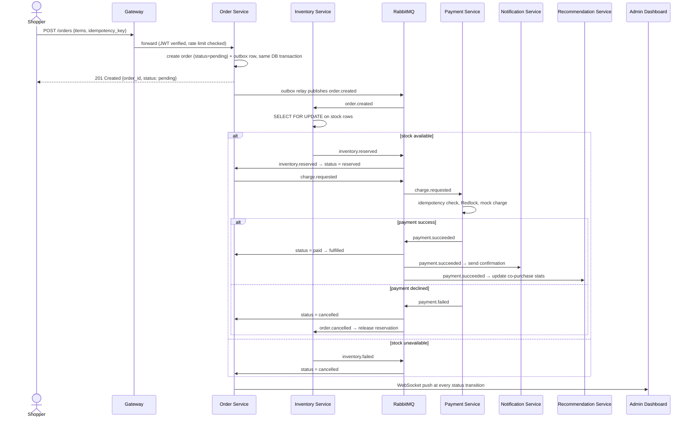

# PRD — Distributed Commerce & Payments Engine

| | |
|---|---|
| **Status** | Draft v1 |
| **Author** | Koushik |
| **Last updated** | Week 0 (pre-build) |
| **Related docs** | [`ARCHITECTURE.md`](./ARCHITECTURE.md) — technical design, data model, API contracts, scaffold |

### Version history

| Version | Date | Changes |
|---|---|---|
| v1 | Week 0 | Initial draft — scope, flows, requirements defined before any code exists |

---

## 1. Overview

We're building the backend + admin frontend for an e-commerce checkout system, focused entirely on what happens **after "Buy Now" is clicked**: reserving stock correctly under concurrent demand, charging payment exactly once, and keeping every downstream system (notifications, recommendations, an admin dashboard) consistent with what actually happened — even when parts of the system fail mid-flow.

This is not a storefront. There's no product browsing UI, no cart persistence, no search. Those are solved problems that don't teach anything new. The scope is the order/payment/inventory pipeline and the correctness guarantees around it.

## 2. Goals & success metrics

| Goal | How we'll know it's true |
|---|---|
| No overselling under concurrent load | A test firing N concurrent order requests for the last unit of stock results in exactly 1 success, N−1 clean failures |
| No double-charging on retry | Replaying the same order request with the same idempotency key never creates a second payment |
| Full failure recovery (no stuck orders) | Every failure path (stock unavailable, payment declined, service crash mid-saga) ends in a terminal, correct order status — never stuck in `pending` indefinitely |
| Observable | Given an order ID, one trace shows every hop across all 5 backend services |
| Verifiable engineering practice | Tests + CI gate + Docker deploy + documented decisions, all in place at ship |

## 3. Non-goals / out of scope (v1)

- Real payment gateway integration (Stripe/Razorpay APIs) — mocked gateway with configurable success/failure/latency.
- Product catalog browsing, search, cart persistence, reviews.
- User-facing storefront UI — the only UI is the **admin dashboard**.
- Horizontal scaling proof / real sharding — designed for, not demonstrated at load.
- Anything beyond a simple rules-based Recommendation Service (explicitly kept light).

## 4. Assumptions & constraints

**Assumptions:**
- Single currency, no multi-currency handling.
- Single-region deployment; no geo-distribution.
- The mocked payment gateway is deterministic within what's configured (success/failure/latency knobs), not randomly flaky beyond that.
- One admin role is sufficient — no finer-grained admin permission tiers in v1.

**Constraints:**
- Solo build, part-time alongside a full-time job — schedule risk shapes the non-goals above more than technical limitations do.
- Free-tier infrastructure only (see `ARCHITECTURE.md` §9 for what that implies for deployment).
- No budget for paid third-party services (real payment gateway, paid auth provider) in v1.

## 5. Personas

- **Shopper** — not a human clicking a UI in v1; represented by API calls (Postman/script) that simulate placing orders, including concurrent/adversarial ones (retries, duplicate requests) to prove correctness. A minimal shopper-facing UI is a stretch item only if time allows.
- **Admin** — the real user of the one UI we build. Watches orders/inventory/payments happen live, needs to see failures and system health at a glance.

## 6. User stories

| As a... | I want to... | So that... |
|---|---|---|
| Shopper | place an order with multiple line items in one request | I don't have to check out separately per item |
| Shopper | safely retry a submitted order request | a network timeout doesn't result in being charged twice |
| Shopper | get an immediate order ID without waiting for payment to fully process | I'm not blocked on a slow downstream step |
| Admin | see order status changes in real time | I can spot stuck or failing orders without refreshing |
| Admin | see *why* an order was cancelled (stock vs. payment) | I can tell operational issues apart from customer-side ones |
| Admin | trace a single order across every service it touched | I can debug one failed order without grepping five log files |

## 7. End-to-end flow

### 7.1 Happy path — narrative

1. A shopper submits an order: a list of `{product_id, quantity}` items, with a client-generated idempotency key.
2. The system creates the order in `pending` status and immediately returns an `order_id` — the shopper doesn't wait for the full pipeline synchronously.
3. In the background, the system reserves stock for every item. If all items have enough stock, the reservation succeeds and the order moves to `reserved`.
4. Once reserved, the system attempts to charge payment (mocked gateway) for the order total, using the idempotency key to guarantee a single charge even if this step is retried.
5. If payment succeeds, the order moves to `paid`, then `fulfilled`. A (fake) confirmation notification is sent. The recommendation service records this purchase for future "customers who bought X also bought Y" logic.
6. Throughout this entire sequence, the admin dashboard receives live push updates — an admin watching the dashboard sees the order move through each status in near real time, with inventory and payment metrics updating alongside it.

### 7.2 Failure & recovery paths — narrative

- **Stock unavailable:** if any item can't be reserved, the order moves straight to `cancelled`. Any items that *were* reserved for other lines in the same order get released. No payment is ever attempted.
- **Payment declined (mocked failure):** the order moves to `cancelled`, and — critically — the previously reserved stock is released back to available inventory (the compensating action). Nothing is left "reserved but abandoned."
- **Duplicate/retried request:** submitting the exact same order request twice (same idempotency key) never results in two orders or two charges. The second call returns the same result as the first.
- **A service crashes mid-flow:** because state transitions are driven by durably-published events (not in-memory calls), the flow resumes correctly once the crashed service comes back — no order is silently lost (see `ARCHITECTURE.md` for the outbox pattern this relies on).
- **Rate limit exceeded:** the shopper gets a clear `429` response with a retry-after hint, not a generic error.

### 7.3 Sequence diagram

## 8. UI/UX requirements (admin dashboard)

The dashboard is the one real UI in this system. Required views:

| View | Contents |
|---|---|
| Orders | Live list of orders with status badges; filter by status; click into an order to see its full event timeline (created → reserved → paid → fulfilled/cancelled) with timestamps |
| Inventory | Current stock per product; highlights low/out-of-stock items; shows active reservations against each product |
| Payments / Ledger | Payment attempts with outcome, and ledger entries for a given order |
| System health | Live request rate and error rate at a glance; link-out to Grafana for deeper metrics |

All views update via WebSocket push (FR-6) — no manual refresh required.

## 9. Functional requirements

| ID | Requirement |
|---|---|
| FR-1 | System must accept an order with 1+ line items and return an order ID synchronously, without waiting for reservation/payment to complete. |
| FR-2 | System must never allow reserved stock to exceed available stock, under any concurrency level. |
| FR-3 | System must never process two payments for the same idempotency key. |
| FR-4 | System must release reserved stock automatically if payment fails or is never attempted. |
| FR-5 | Every order must reach a terminal status (`fulfilled` or `cancelled`) — no order may remain `pending`/`reserved` indefinitely without a bounded timeout + reconciliation. |
| FR-6 | Admin dashboard must reflect order/inventory/payment state changes within ~1 second of them happening (via WebSocket, not polling). |
| FR-7 | All mutating endpoints must be rate-limited per client. |
| FR-8 | A notification (logged, not real email) must be triggered on successful fulfillment. |
| FR-9 | Recommendation data must update after a successful order, without blocking the order's own completion. |
| FR-10 | System must never create two orders for the same idempotency key. A replayed submission must return the originally created order. |

## 10. Non-functional requirements

| Category | Requirement |
|---|---|
| Observability | Any single order must be traceable end-to-end via one trace ID across all services it touched. |
| Security | All endpoints require valid JWT except health checks; role-based access separates shopper-level actions from admin-level actions. |
| Reliability | Losing/restarting any one non-Gateway service must not lose in-flight orders (durable events, not in-memory state). |
| Testability | Every FR above must be backed by an automated test, not manual verification. |
| Performance | No specific SLA target for v1 — correctness over throughput. |

## 11. Release plan

| Milestone | Scope | Exit criteria |
|---|---|---|
| M0 — Foundation | Auth (JWT+OAuth2, RBAC), service scaffolding, DB schema | Services boot via Docker Compose; auth issues/validates tokens |
| M1 — Core order flow | Order + Inventory services, row-level locking | FR-1, FR-2 pass under a concurrent-request test |
| M2 — Payments & saga | Payment service, outbox, saga orchestration, compensations | FR-3, FR-4, FR-5 pass, including all failure paths in §7.2 |
| M3 — Realtime & observability | WebSocket dashboard updates, OpenTelemetry, Prometheus/Grafana | FR-6 passes; a single order is traceable end-to-end |
| M4 — Hardening & ship | Full test suite, CI gate, deployment | All FRs automated and passing in CI; system deployed |

Detailed week-by-week engineering schedule is tracked separately outside this repository.

## 12. Open questions

- ~~Exact enum values for order status~~ — **resolved (M1):** `pending`, `reserved`, `paid`, `fulfilled`, `cancelled`. See `ARCHITECTURE.md` §13.
- Whether a minimal shopper-facing UI is worth building as a stretch item, or whether API-only (Postman collection / script) is sufficient for demo purposes. Leaning toward API-only + a good demo script, per non-goals above.

## 13. See also

Architecture, tech stack, data model, API contracts, event schemas, security design, deployment topology, and the full repo scaffold live in [`ARCHITECTURE.md`](./ARCHITECTURE.md) — that's the "how," this doc is the "what and why."
